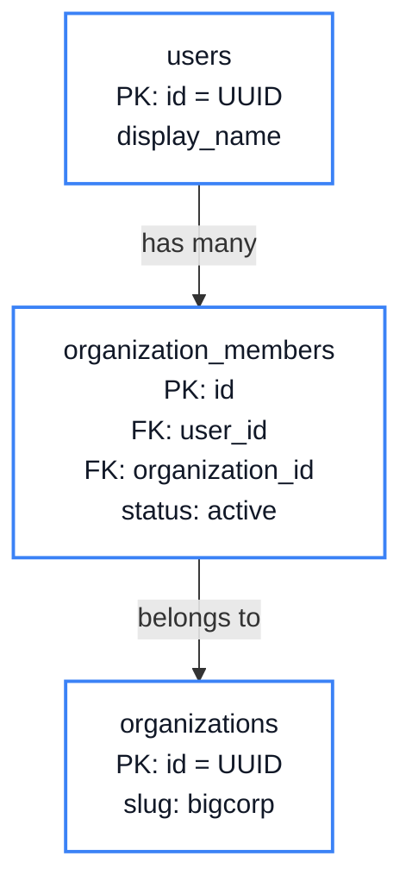

# Rooiam Book Diagram Standards

This file is the source of truth for diagram consistency in `rooiam-book`.

## Core Rules

1. Keep diagrams readable on the first pass.
2. Prefer plain Mermaid text labels over injected HTML.
3. Add one short explanatory sentence before or after important schema diagrams.
4. Use the same visual language across chapters:
   - white diagram surface
   - dark text
   - blue borders for neutral structure
   - amber only for notes
   - red only for danger or failure
5. If a diagram becomes crowded, simplify the node text instead of shrinking the font.

## Schema Diagrams

Use `flowchart TD` or `flowchart LR` with plain text nodes.

Preferred pattern:

Rules:
- Use ` ` for line breaks inside nodes.
- Keep labels short and structural.
- Prefer `TEXT[]` over literal examples like `[]` when the literal hurts Mermaid parsing.
- Add `classDef table ...` to schema diagrams so they stay visually consistent.

## Sequence Diagrams

Use standard Mermaid `sequenceDiagram`.

Rules:
- Keep actor names short.
- Keep message labels short and explanatory.
- Split very dense flows into two diagrams instead of one oversized one.

## Descriptions

Important diagrams should have a one-line explanation nearby:
- what the diagram shows
- why the reader should care

Good:
- `This schema shows the minimum rows and foreign-key links needed to support API keys.`

Bad:
- `Here is the schema.`

## Avoid

- HTML-heavy Mermaid labels
- oversized paragraphs inside nodes
- tiny text used to save space
- dark diagram backgrounds unless the chapter specifically requires it
- diagrams with no nearby explanation

## Fallback Doctrine

If a Mermaid diagram cannot render cleanly:
- simplify it
- remove fragile syntax
- prefer a smaller, clearer diagram over a visually clever one
