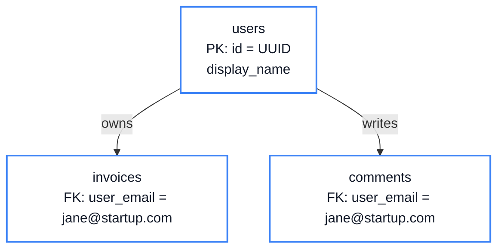
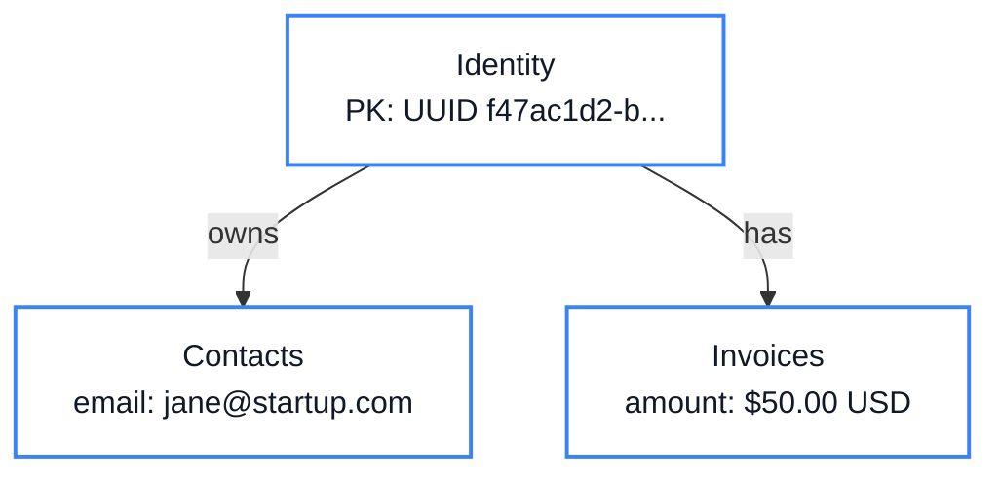
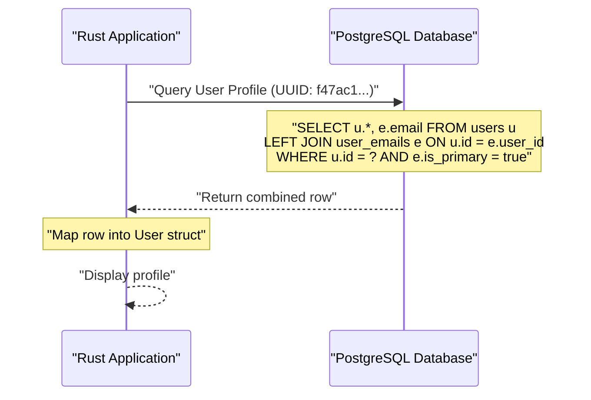

# Chapter 1: The Core Database

<span class="chapter-label">Chapter 1 — Foundations</span>

<p class="chapter-intro">
Every user in a system must begin somewhere. In this chapter, we answer a basic question: <em>what exactly is a user?</em> The answer shapes every table and security decision that follows. We will look at the common mistakes beginners make, how to solve them in theory, and exactly how we solve them in Rooiam.
</p>

## 1.1 The Problem Before: The Primary Key Flaw

When you first learn how to build a database, you learn to pick a **Primary Key**—a unique identifier for a row. Because every user has an email address, it feels natural to use the email address as the primary key.

Here is what the **naive approach** looks like:

```sql
-- Common beginner pattern — dangerous in production!
CREATE TABLE users (
    email      VARCHAR(255) PRIMARY KEY,
    name       VARCHAR(100),
    created_at TIMESTAMP DEFAULT NOW()
);

CREATE TABLE invoices (
    id         SERIAL PRIMARY KEY,
    user_email VARCHAR(255) REFERENCES users(email),
    amount     DECIMAL
);
```

### The Scenario
Imagine a user named Jane. She works at a startup, so she registers with `jane@startup.com`.
Over the next year, Jane generates 50 invoices, writes 200 comments, and creates 5 projects. All of these records in the database have `user_email = 'jane@startup.com'`.



### The Cascading Disaster
One year later, Jane gets a new job at MegaCorp. She wants to change her email to `jane@megacorp.com`.

Because her email is the primary key, the database must find and change **every single row in every single table** that ever referenced `jane@startup.com`. This is called a **Cascading Update**.
- If the system is large, this means updating millions of rows just because a user changed their email.
- If the server crashes halfway through the update, Jane's data becomes corrupted. Half her invoices point to the old email, and half point to the new one.

> **The Core Problem:** Human attributes (like emails or phone numbers) change. A primary key must **never** change.

---

## 1.2 How to Solve in Theory: The Stable Anchor

To fix this, computer scientists separate two concepts that beginners often mix up:

| Concept | Definition | Can it change? |
|---|---|---|
| **Identity** | The permanent, digital existence of the user in your system. | **Never.** |
| **Contact / Credential** | How the user is reached or how they prove who they are (email, password, phone, Google account). | **Frequently.** |

Instead of using an email, we give every user an invisible, random identifier called a **Universally Unique Identifier (UUID)**. 

A UUID looks like this: `f47ac10b-58cc-4372-a567-0e02b2c3d479`. It is generated by the computer, guaranteed to be unique, and the user never sees it or types it. 

### The Theoretical Solution
We split the data into two tables:
1. One table holds the permanent identity (the UUID).
2. Another table holds the contact methods (the emails), linking back to the UUID.



Now, if Jane changes her email, we just add `jane@megacorp.com` to the `Contact_Methods` table and delete the old one. We don't have to touch a single invoice!

---

## 1.3 How to Solve in Rooiam: The Two-Table Schema

Let's look at exactly how Rooiam implements this theory in its database. Storing each unique fact in only one place is called **Database Normalization**. 

Rooiam uses two specific PostgreSQL tables:

```sql
-- Table 1: The permanent identity anchor
CREATE TABLE users (
    id                UUID        PRIMARY KEY DEFAULT gen_random_uuid(),
    display_name      VARCHAR(100),
    avatar_url        VARCHAR(512),
    status            VARCHAR(20)  NOT NULL DEFAULT 'active'
);

-- Table 2: Detachable contact facts, linked by UUID
CREATE TABLE user_emails (
    id          UUID        PRIMARY KEY DEFAULT gen_random_uuid(),
    user_id     UUID        NOT NULL REFERENCES users(id) ON DELETE CASCADE,
    email       VARCHAR(255) UNIQUE NOT NULL,
    is_primary  BOOLEAN     NOT NULL DEFAULT false,
    is_verified BOOLEAN     NOT NULL DEFAULT false
);

-- Enforce exactly one primary email per user at the database level
CREATE UNIQUE INDEX idx_user_emails_one_primary
    ON user_emails (user_id)
    WHERE is_primary = true;
```

### Explaining the Design Step-by-Step
1. **`uuid` Primary Key:** The `users.id` is generated automatically. It never changes. All other tables in Rooiam (like roles, sessions, or API keys) point to this `id`.
2. **`ON DELETE CASCADE`:** If an administrator deletes a user from the `users` table, the database automatically deletes all their emails from `user_emails`. No orphaned emails are left behind.
3. **`UNIQUE` on `email`:** The database ensures no two users can register the same email address. This prevents account takeover attacks.
4. **The Partial Index (`WHERE is_primary = true`):** This guarantees that a user can have multiple emails, but **only one** can be the primary email. Even if our application code has a bug, the database physics physically reject a second primary email.

---

## 1.4 Structure of Objects in Rooiam (Rust)

Rooiam is written in Rust. Every database table maps to a corresponding Rust **struct** (an object structure). 

If a column type in the database doesn't match the Rust struct field, the compiler rejects the code before the server can even start. Here are the exact structures we use:

```rust
// src/modules/identity/models.rs
use serde::{Deserialize, Serialize};
use uuid::Uuid;
use chrono::{DateTime, Utc};

/// The permanent identity anchor in the application code.
#[derive(Debug, Clone, Serialize, Deserialize)]
pub struct User {
    pub id:               Uuid,
    
    // Note: This is an Option because a user might register with a Passkey
    // and not have an email address yet!
    pub email:            Option<String>,
    
    pub display_name:     Option<String>,
    pub avatar_url:       Option<String>,
    pub status:           String,        // "active" | "suspended"
}

/// A single email address attached to a user.
#[derive(Debug, Clone, Serialize, Deserialize)]
pub struct UserEmail {
    pub id:          Uuid,
    pub user_id:     Uuid,            // ← references User.id
    pub email:       String,
    pub is_primary:  bool,
    pub is_verified: bool,
}
```

Because `users` has no `email` column, we must join the data together when we want to display it to the user.

### Exploring the Join Pattern
When Rooiam looks up a user during login, it combines these structures step-by-step:



Notice we use a `LEFT JOIN` instead of an `INNER JOIN`. This is an architecture decision: we want to successfully load the `User` struct even if they have **no primary email** (for instance, if they registered using only their face via Apple FaceID / WebAuthn).

---

## 1.5 Why This Matters for Security

This two-table design is not merely an organizational nicety for the database. It is the foundation for every IAM security feature:

- **Social Logins:** A `UNIQUE` constraint on `user_emails.email` prevents a malicious actor from claiming another user's email via an unverified OAuth provider.
- **Multi-Tenancy:** Thousands of workspace memberships safely reference the same immutable UUID, meaning email changes don't corrupt workspace security roles.
- **Account Recovery:** The secure email-change flow (request → verify → swap) is only safe because the UUID anchor never moves during the transition.

> **Core Principle:** Design your systems so that correctness is enforced by database constraints, not by application code alone. Application code has bugs. Mathematics and constraints do not.

---

<div class="summary-box">
<div class="summary-box-title">Chapter Summary</div>

- **The Problem:** Using an email address as a primary key requires massive "cascading updates" if the email ever changes.
- **The Theory:** Separate the permanent **Identity** from the mutable **Contact Method**.
- **The Solution:** Use a randomly generated **UUID** as every user's primary key. Link emails via a separate `user_emails` table.
- **Database Normalization:** Enforce business rules (like "one primary email per user") using database unique indexes so bugs can't corrupt your data.
- **Rust Strictness:** Map these tables exactly to Rust structs so the compiler enforces data types.

</div>

---

<div class="exercises">
<div class="exercises-title">Exercises</div>

1. Open `src/modules/identity/models.rs`. The `User` struct has an `Option<String>` for the email field. Write a SQL query that would return a `User` row *without* joining the email. What value would `user.email` hold in Rust?
2. Attempt to insert two `user_emails` rows with `is_primary = true` for the same `user_id` in a database console. What error does PostgreSQL produce? Which layer of the system stopped you — the database, the ORM, or the application?
3. Trace what happens when an administrator sets `users.status = 'suspended'` for a user who is currently logged in. Which code path checks this status on their *next request*?
4. Design a `user_phone_numbers` table following the exact same normalization pattern as `user_emails`. Draw a Mermaid diagram of how it connects to the `users` table.

</div>
