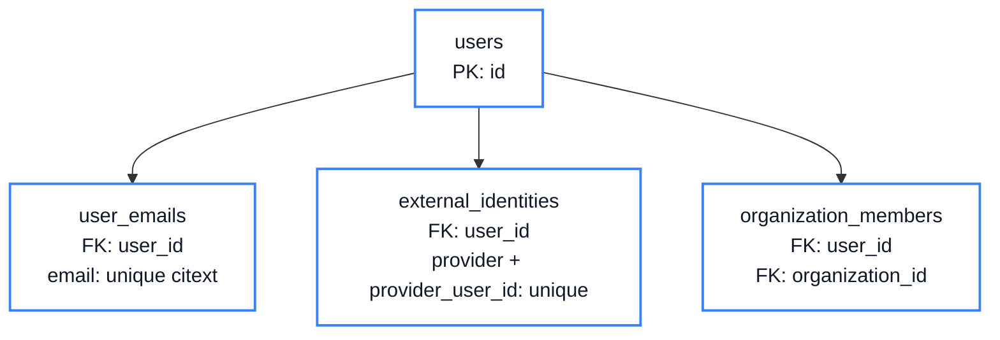

# Chapter 1: The Identity Core

A user needs an identity that survives a changed email address, a new login provider, and membership in several workspaces. Rooiam uses a UUID as that stable anchor.

## Why email is not the user ID

If invoices or memberships refer to an email address directly, changing that address can break those relationships. A UUID lets identity stay stable while contact information changes. Downstream business records belong in the downstream application's database; Rooiam stores identity and access data.

## The current database model

`0001_init.sql` separates these records:

| Table | Relevant columns | Purpose |
|---|---|---|
| `users` | `id`, `display_name`, `avatar_url`, `status` | Stable identity |
| `user_emails` | `user_id`, `email`, `is_primary`, `is_verified`, `verified_at` | Contact and verification state |
| `external_identities` | `user_id`, `provider`, `provider_user_id` | Provider identity mapping |
| `organization_members` | `user_id`, `organization_id`, `status` | Workspace membership |

`user_emails.email` is unique and uses PostgreSQL `citext`. Primary status and verification status are separate facts: marking an address primary does not prove ownership. Later migrations add fields such as platform privilege flags and last-seen timestamps to `users`.


```mermaid
flowchart TD
    users["users<br/>PK: id"]
    emails["user_emails<br/>FK: user_id<br/>email: unique citext"]
    identities["external_identities<br/>FK: user_id<br/>provider + provider_user_id: unique"]
    members["organization_members<br/>FK: user_id<br/>FK: organization_id"]
    users --> emails
    users --> identities
    users --> members
    classDef table fill:#ffffff,stroke:#3b82f6,stroke-width:2px,color:#111827;
    class users,emails,identities,members table;
```

The diagram shows how several login identities and memberships refer to one user.

## Reading the implementation

`modules/identity/models.rs` defines the Rust records. `IdentityRepository` reads and updates them. Creation and linking operations must preserve uniqueness and verification checks; a matching email string alone is not sufficient identity proof.

This is a useful read-only query for understanding the relationship:

```sql
SELECT u.id, u.display_name, e.email, e.is_verified
FROM users u
LEFT JOIN user_emails e ON e.user_id = u.id AND e.is_primary = true;
```

The query is a teaching example, not a replacement for the repository's API response queries. Apply the complete migration chain to build the database; individual chapter tables are summaries.

## Exercises

1. Why should a downstream app store Rooiam's subject identifier separately from its editable profile email?
2. Find the transaction used to create a user with an external identity. Which rows must succeed together?
3. Trace how a suspended user is rejected by session validation.

## Follow the source

- [rooiam-server/migrations/0001_init.sql](https://github.com/theparitt/rooiam/blob/c20b9edfa8ce23649fd9107b35f9f20e1251b39b/rooiam-server/migrations/0001_init.sql)
- [rooiam-server/src/modules/identity/models.rs](https://github.com/theparitt/rooiam/blob/c20b9edfa8ce23649fd9107b35f9f20e1251b39b/rooiam-server/src/modules/identity/models.rs)
- [rooiam-server/src/modules/identity/repository.rs](https://github.com/theparitt/rooiam/blob/c20b9edfa8ce23649fd9107b35f9f20e1251b39b/rooiam-server/src/modules/identity/repository.rs)
