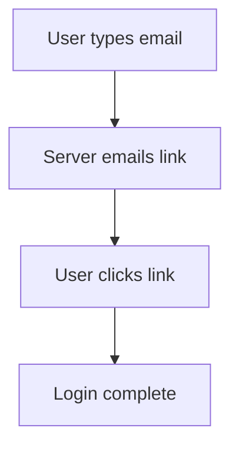
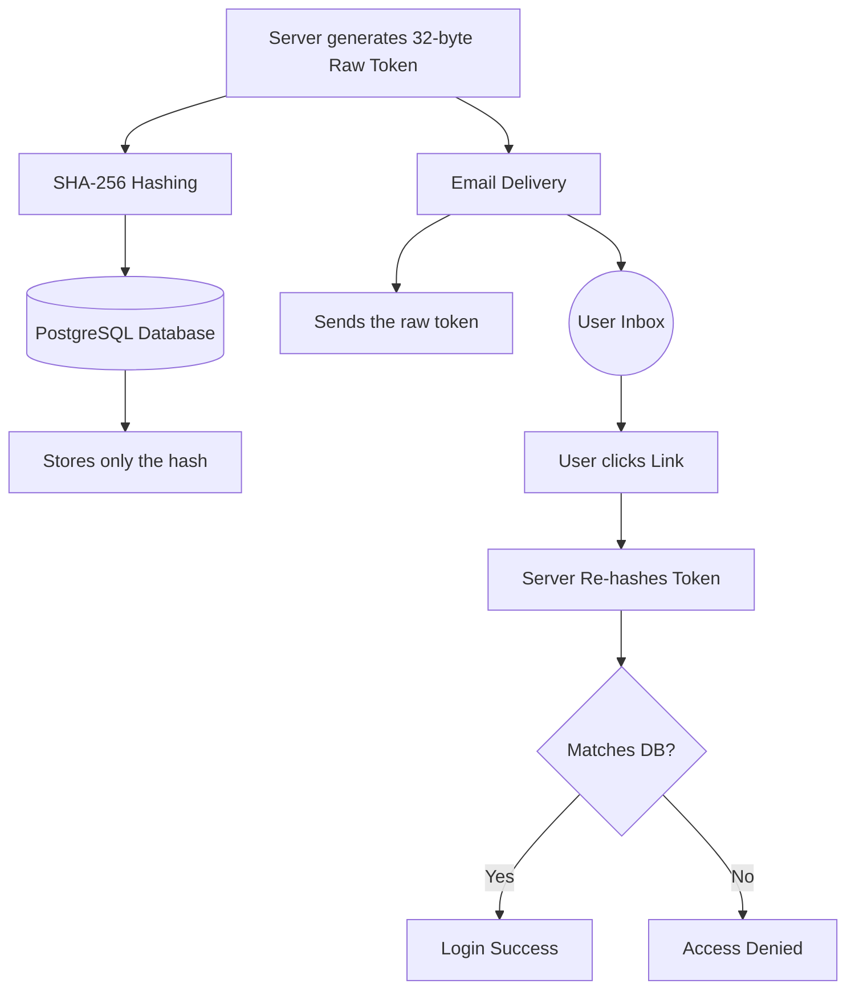
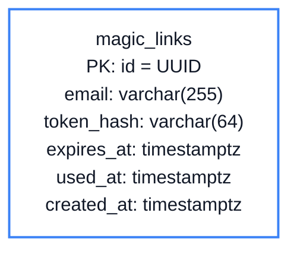
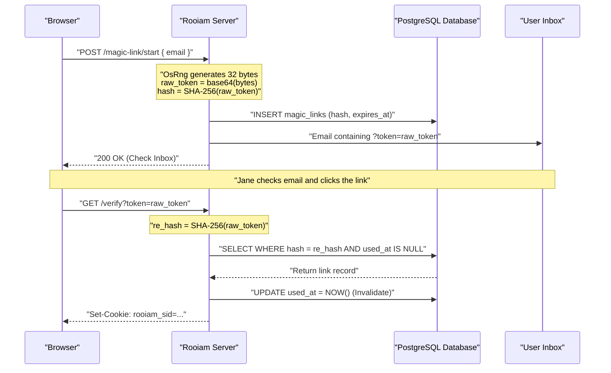

# Chapter 2: Magic Link Authentication

<span class="chapter-label">Chapter 2 — Cryptography Basics</span>

<p class="chapter-intro">
Passwords are a 50-year-old idea designed for an era before the internet. This chapter explains
why passwordless login is not just a convenience feature but a fundamental security improvement —
and shows exactly how Rooiam implements it using real cryptographic primitives.
</p>

## 2.1 The Password Problem

For decades, authentication worked like this:
1. User picks a secret string (a password).
2. Server stores the password (or a hash of it).
3. User types the password on every login.

The flaw is not in the mathematics — it is in human behavior. Studies consistently show that the majority of internet users reuse the same password across dozens of websites. When a hacker breaches a low-security site (a pizza delivery service, a forum, a game), they steal a list of email/password pairs. They then run an automated script that tries each stolen pair against thousands of higher-value targets: banks, email providers, corporate SaaS platforms. This attack is called **Credential Stuffing**, and it succeeds at scale precisely because of password reuse.

The modern solution: **eliminate passwords entirely**. If there is no password, it cannot be reused, guessed, phished, or stuffed.

## 2.2 Magic Links: The Proof-of-Inbox Model

A Magic Link replaces the password with a simple mathematical proof:

> *If you can click a link that was sent exclusively to your email inbox, you have proven you control that inbox.*

The flow is:



No password to remember. No password to steal. The "credential" is a short-lived token that lives in the user's inbox and can only be used once.

But this raises an immediate question: **where does the server store the token while it waits for the user to check email?**

## 2.3 The Storage Problem: Never Store Plaintext Secrets

Suppose the server simply stores the token in the database:

```sql
-- INSECURE — never do this
INSERT INTO magic_links (email, token) VALUES ('jane@example.com', 'abc12345');
```

Now imagine a database breach — a SQL injection attack, a stolen backup, a rogue employee with read access. The attacker opens the `magic_links` table and sees `token = 'abc12345'`. They copy it into their browser URL, and they are logged in as Jane. **Storing any secret in plaintext is always wrong.**

The solution is a **Cryptographic Hash Function**.

## 2.4 The One-Way Hash: SHA-256

A cryptographic hash function takes any input and produces a fixed-size output — a "digest" — with three critical properties:

**Deterministic**: the same input always produces the same output.

**Avalanche effect**: changing even one character of the input produces a completely different output.

**Pre-image resistance**: given the output hash, it is computationally infeasible to reconstruct the input. A supercomputer testing a billion guesses per second would take longer than the age of the universe to reverse a SHA-256 hash of a random 32-byte token.

```
SHA-256("apple")  →  3a7bd3e2360a3d29eea436fcfb7e44c735d117c42d1c...
SHA-256("appIe")  →  e68fc6c7e9cc4b6e2c6d5e9eff4b9b3289fbd...  (completely different)
```

Rooiam uses SHA-256 to protect magic link tokens:


<p class="diagram-caption">Figure 2.1 — The hash acts as a one-way gate. The database stores only the digest; the raw token travels only through email.</p>

Even if an attacker steals the entire `magic_links` table, they have a list of SHA-256 digests. These are useless — they cannot be reversed into clickable tokens.

## 2.5 Entropy: Why Not Use `Math.random()`?

A hash is only as secure as the randomness of the input. If the token is predictable, an attacker can precompute its hash.

Many beginner implementations use the programming language's built-in random number generator. These generators use the system clock as a seed — meaning two tokens generated one second apart might differ by only a few bits. An attacker who knows the approximate time a token was generated can exhaustively try all possible clock-seeded values.

Rooiam uses the operating system's **cryptographically secure random number generator** — `OsRng` in Rust. This draws entropy from physical hardware noise (CPU thermal noise, network packet timing, disk latency variations). The result is 32 bytes of true randomness that cannot be predicted, even by an attacker who knows the exact time of generation.

## 2.6 The Magic Links Table

Magic link tokens are ephemeral. They must expire quickly (to limit the window of attack) and be usable exactly once (to prevent replay attacks):



```sql
CREATE TABLE magic_links (
    id         UUID        PRIMARY KEY DEFAULT gen_random_uuid(),
    email      VARCHAR(255) NOT NULL,
    token_hash VARCHAR(64)  NOT NULL,   -- SHA-256 hex digest (64 chars)
    redirect_uri VARCHAR(512),          -- where to send the user after login
    expires_at TIMESTAMPTZ NOT NULL,    -- default: 15 minutes from creation
    used_at    TIMESTAMPTZ,             -- NULL = unused; filled = permanently dead
    created_at TIMESTAMPTZ NOT NULL DEFAULT NOW()
);

CREATE INDEX idx_magic_links_hash ON magic_links (token_hash);
```

The `used_at` column is the **replay attack defense**. When a link is clicked:
1. The server looks up the token by its hash.
2. It checks `used_at IS NULL` — if already used, access is denied immediately.
3. It checks `expires_at > NOW()` — expired tokens are rejected.
4. It sets `used_at = NOW()` atomically before creating the session.

Steps 2-4 happen inside a single database transaction. There is no window in which two simultaneous clicks of the same link can both succeed.

## 2.7 The Rust Implementation

The complete magic link start flow in `src/modules/auth/service.rs`:

```rust
pub async fn start_magic_link(
    &self,
    email: String,
    redirect_uri: Option<String>,
) -> Result<(), AppError> {
    // 1. Normalize the email — prevents "Jane@Example.COM" and "jane@example.com"
    //    from being treated as different identities
    let normalized_email = email.trim().to_lowercase();

    // 2. Generate 32 bytes of true OS entropy
    let mut bytes = [0u8; 32];
    OsRng.fill_bytes(&mut bytes);

    // 3. Base64url-encode the bytes into a URL-safe string
    //    Result: a 43-character string like "dBjftJeZ4CVP-mB92K27uhbUJU1p1r_wW1gFWFOEjXk"
    let raw_token = URL_SAFE_NO_PAD.encode(bytes);

    // 4. Hash the token — this is what gets stored
    let mut hasher = Sha256::new();
    hasher.update(raw_token.as_bytes());
    let hash_hex = hex::encode(hasher.finalize());

    // 5. Determine expiry: org override → platform setting → default 15 minutes
    let expiry = chrono::Utc::now() + chrono::Duration::minutes(15);

    // 6. Persist ONLY the hash — raw_token is never written to the database
    self.repo.create_magic_link(&normalized_email, &hash_hex, expiry, redirect_uri.clone()).await?;

    // 7. Build the clickable URL containing the raw token and email it
    //    raw_token travels only through email — never touches the database
    let verify_url = format!("https://app.example.com/verify?token={}", raw_token);
    send_magic_link_email(&normalized_email, &verify_url).await?;

    // 8. Always return success — even for unknown emails (anti-enumeration)
    Ok(())
}
```

<div class="callout warning">
<div class="callout-title">⚠ Anti-Enumeration</div>

Notice that the function returns `Ok(())` for *any* email, even one that does not exist in the database. If the server returned an error for unknown emails, an attacker could probe the endpoint to build a list of registered users. By always responding identically ("check your inbox"), the server gives the attacker zero information about which emails are registered.

</div>

The verification flow:

```rust
pub async fn verify_magic_link(&self, raw_token: &str) -> Result<MagicLink, AppError> {
    // 1. Recompute the hash from the token the user clicked
    let mut hasher = Sha256::new();
    hasher.update(raw_token.as_bytes());
    let hash_hex = hex::encode(hasher.finalize());

    // 2. Look up the token — WHERE token_hash = $1 AND used_at IS NULL AND expires_at > NOW()
    //    If not found (wrong token, expired, or already used), returns 401 Unauthorized
    let link = self.repo.get_valid_magic_link(&hash_hex).await?;

    // 3. Mark as used immediately — prevents replay attacks
    //    This runs in a transaction with step 2 to prevent race conditions
    self.repo.mark_magic_link_used(link.id).await?;

    Ok(link)
}
```

The struct returned by `get_valid_magic_link` uses `#[serde(skip)]` to ensure the hash can *never* accidentally appear in an API response:

```rust
#[derive(Debug, Serialize, sqlx::FromRow)]
pub struct MagicLink {
    pub id:          Uuid,
    pub email:       String,

    #[serde(skip)]   // ← hash is NEVER serialized to JSON under any circumstances
    pub token_hash:  String,

    pub redirect_uri: Option<String>,
    pub expires_at:  DateTime<Utc>,
    pub used_at:     Option<DateTime<Utc>>,
}
```

## 2.8 The Full Flow End-to-End


<p class="diagram-caption">Figure 2.2 — Complete magic link flow. The raw token travels only through email. The database stores only the hash.</p>

---

<div class="summary-box">
<div class="summary-box-title">Chapter Summary</div>

- **Credential stuffing** exploits password reuse. Magic links eliminate passwords entirely.
- A **cryptographic hash function** (SHA-256) transforms a secret token into a one-way digest. The digest cannot be reversed into the original token.
- The server stores only the **hash**. The raw token travels only through email — the attacker cannot intercept it from the database.
- **OS entropy** (`OsRng`) produces truly random tokens that cannot be predicted from the system clock.
- `used_at` prevents **replay attacks** — a clicked link becomes permanently dead after one use.
- **Anti-enumeration**: the server always responds "check your inbox" regardless of whether the email is registered.

</div>

---

<div class="exercises">
<div class="exercises-title">Exercises</div>

1. In `src/modules/auth/service.rs`, find where `OsRng` is used. Replace it mentally with `rand::thread_rng()`. What security property is lost? What kind of attack does this enable?

2. What happens if an attacker captures the magic link URL from a browser's history and tries to click it 30 minutes after the original user already clicked it? Trace through the database query to find which condition blocks them.

3. The `magic_links` table stores the `email`, not the `user_id`. Why? At what point in the flow does the server look up (or create) a `User` record? Find this in `src/modules/auth/handlers.rs`.

4. A competitor's system sends magic links that expire in 24 hours instead of 15 minutes. What security trade-off does this represent? What kinds of attacks does a longer expiry window open up?

5. The `#[serde(skip)]` annotation on `token_hash` prevents it from appearing in JSON. Is this alone sufficient protection? What if a developer adds a `println!("{:?}", link)` to debug an issue? How would you additionally protect against this in the Rust type system?

</div>
