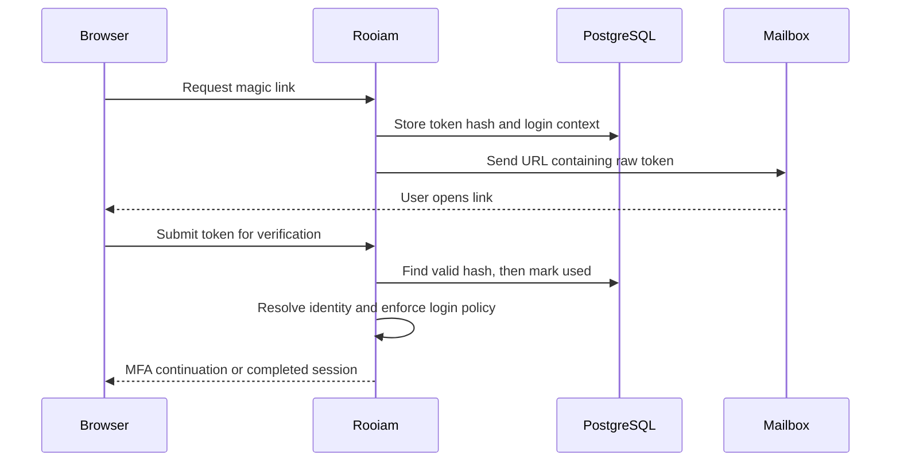

# Chapter 2: Magic Link Authentication

A magic link proves access to a mailbox without introducing an end-user password. The emailed URL carries a bearer secret, so possession of that URL is security-sensitive.

## Generate a secret, store its hash

`AuthService::start_magic_link` generates random bytes with `OsRng`, encodes the token, hashes it with SHA-256, and stores the hash in `magic_links`. The raw token is used to construct the email link.

Hashing is appropriate here because the secret is generated with high entropy. This differs from hashing a human-chosen password, where a slow password-hashing algorithm helps resist guessing.

The record includes `email`, `token_hash`, `purpose`, `redirect_uri`, `surface`, `expires_at`, and `used_at`. The default magic-link lifetime is 15 minutes; effective platform, tenant-portal, or workspace policy can change it.

## From click to session

```mermaid
sequenceDiagram
    participant B as Browser
    participant S as Rooiam
    participant D as PostgreSQL
    participant M as Mailbox
    B->>S: Request magic link
    S->>D: Store token hash and login context
    S->>M: Send URL containing raw token
    M-->>B: User opens link
    B->>S: Submit token for verification
    S->>D: Find valid hash, then mark used
    S->>S: Resolve identity and enforce login policy
    S-->>B: MFA continuation or completed session
```

This diagram separates inbox proof from completing the login. Workspace policy, account status, and required MFA still affect the result.

`AuthRepository::get_valid_magic_link` filters by hash, `used_at IS NULL`, and `expires_at > NOW()`. `AuthService::verify_magic_link` then calls `mark_magic_link_used`.

**Current concurrency limitation:** lookup and marking used are separate database operations. Sequential replay is rejected, but this code does not provide an atomic single-consumer guarantee for simultaneous redemptions. Do not mistake this implementation for an `UPDATE ... RETURNING` claim operation or a locked transaction.

## Redirect and widget context

The service validates supplied redirects. Registered OAuth callbacks and approved first-party URLs have distinct validation paths. For hosted widgets, `widget_login_context` carries the server-validated callback choice; the embedding browser does not send an arbitrary callback to `/login-widget`.

Login completion belongs to the handlers, which coordinate identity, policy, MFA, and session creation. `verify_magic_link` itself returns the link record rather than a completed user session.

## Exercises

1. Explain why leaking a raw email URL is different from leaking its database hash.
2. Find where `magic_link_expiry_minutes` is resolved for a workspace and for the tenant portal.
3. Design an atomic redemption query that rejects two simultaneous uses, and compare it with the current repository operations.

## Follow the source

- [rooiam-server/src/modules/auth/service.rs](https://github.com/theparitt/rooiam/blob/c20b9edfa8ce23649fd9107b35f9f20e1251b39b/rooiam-server/src/modules/auth/service.rs)
- [rooiam-server/src/modules/auth/repository.rs](https://github.com/theparitt/rooiam/blob/c20b9edfa8ce23649fd9107b35f9f20e1251b39b/rooiam-server/src/modules/auth/repository.rs)
- [rooiam-server/src/modules/auth/handlers.rs](https://github.com/theparitt/rooiam/blob/c20b9edfa8ce23649fd9107b35f9f20e1251b39b/rooiam-server/src/modules/auth/handlers.rs)
