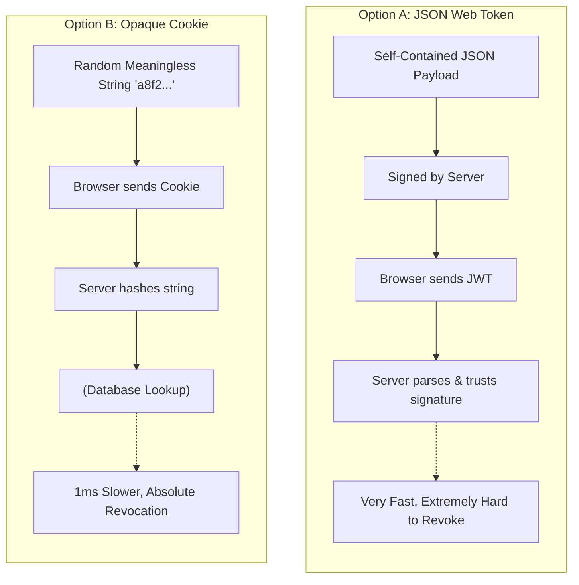
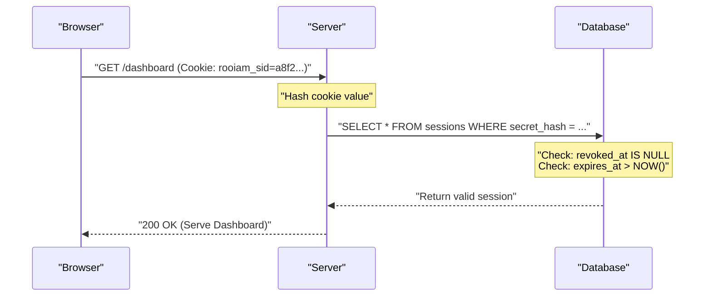
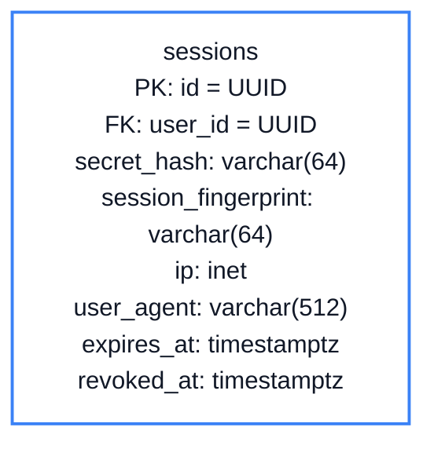

# Chapter 3: Stateful Sessions

<span class="chapter-label">Chapter 3 — Session Architecture</span>

<p class="chapter-intro">
Once a user has proven their identity, the server must remember them for the duration of their
visit. But the internet is fundamentally stateless. This chapter explains the two competing
architectures for solving this problem — and why Rooiam makes a deliberate choice that
prioritizes security over raw speed.
</p>

## 3.1 The Statelessness Problem

HTTP — the protocol that powers the web — has no memory. Each request is completely independent. When your browser loads a page, sends a form, or calls an API, the server treats every single one of those requests as if it has never seen you before.

This is by design: statelessness makes web servers easy to scale (any server can handle any request) and simple to reason about. But it creates a fundamental problem for authentication. After a user proves their identity once, how does the server remember them on the next click?

The answer: the server must give the user a **credential token** that the browser sends automatically on every subsequent request. The server checks this token to know who is making the request.

The critical design question is: *where is the state stored?*

## 3.2 Option A: JSON Web Tokens (Self-Contained State)

A popular modern approach uses **JSON Web Tokens (JWTs)**. A JWT is a self-contained, cryptographically signed document:

```
Header:  { "alg": "RS256", "kid": "key-2024" }
Payload: { "sub": "user-uuid", "role": "admin", "exp": 1735689600 }
Signature: RSASHA256(base64(header) + "." + base64(payload), private_key)
```

The server signs the JWT with its private key. Any server that has the corresponding public key can verify the signature without touching a database. This makes JWTs extremely fast to validate.

**The Fatal Revocation Flaw**

But consider this scenario: a user's laptop is stolen. The user calls IT security and says "revoke my session immediately." With JWTs, this is deeply problematic.

The JWT is valid as long as its signature is valid and `exp` (expiry) has not passed. The token is *self-verifying* — the server trusts it without a database lookup. To revoke a specific JWT, the server would need to maintain a **blacklist** of revoked token IDs in a database or cache.

But maintaining a blacklist means checking the database on every request — which completely eliminates the speed advantage of JWTs. Worse, a distributed blacklist must be synchronized across all server instances, introducing consistency problems. And if the blacklist service is unavailable, what happens? The server must either reject all requests (outage) or accept all requests including the stolen token (security breach).



| | JWT | Opaque Cookie |
|---|---|---|
| State storage | In the token itself | In the database |
| Validation speed | Fast (no DB lookup) | One DB lookup per request |
| Revocation | Complex (needs blacklist) | Instant (delete from DB) |
| Token theft window | Until expiry | Until next request |
| Payload visibility | Readable (base64) | Opaque (random ID) |

## 3.3 Option B: Opaque Stateful Cookies (Rooiam's Choice)

Rooiam uses **opaque session cookies** — a design sometimes called "session tokens" or "server-side sessions."

An opaque cookie contains no information. It is purely a random identifier:

```
rooiam_sid = a8f2c9e1b47d3501f892a6d4c0e7b3f1924a8d5c...
```

This string means nothing on its own. It is a key to a lookup in the `sessions` database table. The server looks up the session on every request, just like a hotel front desk checking a key card number.


<p class="diagram-caption">Figure 3.1 — Every request triggers a session lookup. The server has complete, real-time control over session validity.</p>

**Absolute Revocation**: When an administrator suspends a user or a user clicks "log out of all devices," the server sets `revoked_at = NOW()` on the session row. The very next request from that session — regardless of whether the browser still has the cookie — is rejected. The window of theft is limited to a single request, not the remaining lifetime of a JWT.

## 3.4 The Sessions Table

Before seeing the SQL, visualize the structure of the sessions table. It is built to store not just the token, but critical security metadata used to bind the session to a specific operating environment:



```sql
CREATE TABLE sessions (
    id                   UUID        PRIMARY KEY DEFAULT gen_random_uuid(),
    user_id              UUID        NOT NULL REFERENCES users(id) ON DELETE CASCADE,
    organization_id      UUID        REFERENCES organizations(id),

    -- The opaque cookie value, stored as a SHA-256 hash
    -- (same protection principle as magic link tokens)
    secret_hash          VARCHAR(64) NOT NULL UNIQUE,

    -- Security binding — used for session hijacking detection
    session_fingerprint  VARCHAR(64),         -- hash of device class + IP subnet
    ip                   INET,                -- login IP address
    user_agent           VARCHAR(512),        -- browser/device string

    -- Lifecycle
    created_at           TIMESTAMPTZ NOT NULL DEFAULT NOW(),
    last_seen_at         TIMESTAMPTZ NOT NULL DEFAULT NOW(),
    expires_at           TIMESTAMPTZ NOT NULL,   -- absolute expiry (7 days)
    revoked_at           TIMESTAMPTZ,             -- NULL = valid

    -- Context for multi-tenant routing
    current_org_id       UUID REFERENCES organizations(id),
    app_name             VARCHAR(255)
);

CREATE INDEX idx_sessions_hash ON sessions (secret_hash);
CREATE INDEX idx_sessions_user  ON sessions (user_id) WHERE revoked_at IS NULL;
```

The session cookie value — like the magic link token — is stored as a SHA-256 hash. If the database is stolen, the attacker has a list of hashes. Without the original cookie value (which only exists in the user's browser), these hashes are useless.

## 3.5 The Session Fingerprint

The `session_fingerprint` column implements **session binding** — a defense against cookie theft.

When a session is created, the server computes:
```
fingerprint = SHA-256(device_class + "/" + ip_subnet_16)
```

Where:
- `device_class` is a normalized string derived from the User-Agent: `"desktop/chrome"`, `"mobile/safari"`, etc.
- `ip_subnet_16` is the first 16 bits of the IP address — broad enough to tolerate NAT and DHCP changes while still detecting geographic anomalies.

On every subsequent request, the server recomputes the fingerprint and compares it to the stored one. If they differ significantly, it writes a `auth.session.binding_mismatch` audit event and may revoke the session.

```rust
// src/modules/session/models.rs

#[derive(Debug, Clone, sqlx::FromRow)]
pub struct ActiveSession {
    pub session_id:          Uuid,
    pub user_id:             Uuid,
    pub organization_id:     Option<Uuid>,
    pub current_org_id:      Option<Uuid>,
    pub is_superuser:        bool,
    pub is_platform_owner:   bool,
    pub session_fingerprint: Option<String>,
    pub created_at:          DateTime<Utc>,
    pub last_seen_at:        DateTime<Utc>,
}
```

This struct is what every authenticated route handler receives — a validated, trusted summary of the current session, extracted from the database by the session middleware before the handler code runs.

## 3.6 Session Creation

After a successful magic link verify (or OAuth callback, or passkey login), the server creates a session:

```rust
pub async fn create_opaque_session(
    pool: &PgPool,
    user_id: Uuid,
    org_id: Option<Uuid>,
    ip: Option<String>,
    user_agent: Option<String>,
) -> Result<String, AppError> {
    // 1. Generate a random 32-byte secret
    let mut bytes = [0u8; 32];
    OsRng.fill_bytes(&mut bytes);
    let raw_secret = URL_SAFE_NO_PAD.encode(bytes);

    // 2. Hash it — only the hash is stored
    let mut h = Sha256::new();
    h.update(raw_secret.as_bytes());
    let hash = hex::encode(h.finalize());

    // 3. Compute fingerprint for binding
    let fingerprint = compute_fingerprint(user_agent.as_deref(), ip.as_deref());

    // 4. Insert into sessions table (7-day expiry)
    let expires_at = Utc::now() + Duration::days(7);
    sqlx::query!(
        "INSERT INTO sessions (user_id, organization_id, secret_hash, session_fingerprint,
         ip, user_agent, expires_at)
         VALUES ($1, $2, $3, $4, $5::inet, $6, $7)",
        user_id, org_id, hash, fingerprint,
        ip, user_agent, expires_at
    )
    .execute(pool).await?;

    // 5. Return the raw secret — this is set as the cookie value
    //    It will NEVER appear in the database
    Ok(raw_secret)
}
```

The raw secret is returned and immediately placed in an `HttpOnly; Secure; SameSite=None` cookie. From this point forward, the raw secret lives only in the browser's cookie store and in the user's memory of having logged in.

## 3.7 Concurrent Session Limits

Rooiam supports a per-workspace policy: `max_concurrent_sessions`. When this is set (e.g., to `3`), and a user creates a fourth session, the oldest active session is revoked automatically:

```sql
-- Revoke the oldest session when the limit is exceeded
UPDATE sessions SET revoked_at = NOW()
WHERE user_id = $1
  AND organization_id = $2
  AND revoked_at IS NULL
  AND id = (
    SELECT id FROM sessions
    WHERE user_id = $1 AND organization_id = $2 AND revoked_at IS NULL
    ORDER BY last_seen_at ASC
    LIMIT 1
  );
```

This policy prevents credential-sharing (e.g., a team sharing one account by logging in from 10 devices simultaneously).

---

<div class="summary-box">
<div class="summary-box-title">Chapter Summary</div>

- **JWTs** are self-verifying but cannot be revoked without a blacklist — eliminating their speed advantage.
- **Opaque session cookies** are random IDs with no payload. The server looks up session state in the database on every request.
- Storing the session secret as a **SHA-256 hash** means a stolen database yields no usable credentials.
- The **session fingerprint** (device class + IP subnet) detects session hijacking across geographic locations.
- Rooiam's `ActiveSession` struct gives every route handler pre-validated, typed session context.
- **Absolute revocation** is possible because session state lives in the database, not in the token.

</div>

---

<div class="exercises">
<div class="exercises-title">Exercises</div>

1. A JWT approach requires a blacklist to support revocation. If the blacklist is stored in Redis with a 7-day TTL (matching the JWT expiry), what happens to security if Redis goes down? What happens to availability? Which failure mode is more acceptable for an IAM server?

2. Open the sessions table definition. If `revoked_at IS NULL` is the validity check, what prevents someone from running `UPDATE sessions SET revoked_at = NULL WHERE id = 'xyz'` to un-revoke their session? (Hint: think about database permissions, application-layer access patterns, and audit logs.)

3. The `session_fingerprint` is computed from `device_class + "/" + ip_subnet_16`. A user who connects via mobile data often gets a new IP every few minutes as they roam between towers. How does using `ip_subnet_16` (first 16 bits) instead of the full IP help? What is the trade-off?

4. Trace the session creation through the codebase. After `create_opaque_session` returns the raw secret, which function sets the actual HTTP `Set-Cookie` header? What flags does it set, and why is each flag important?

</div>
