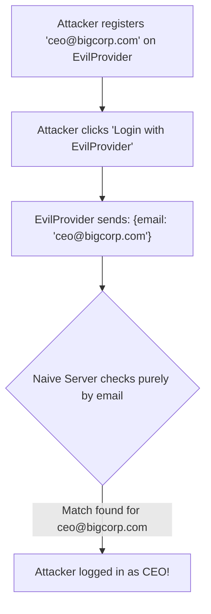
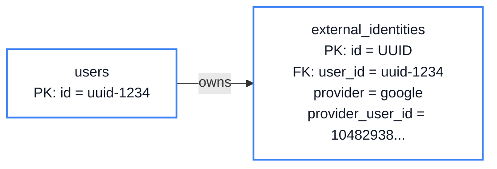
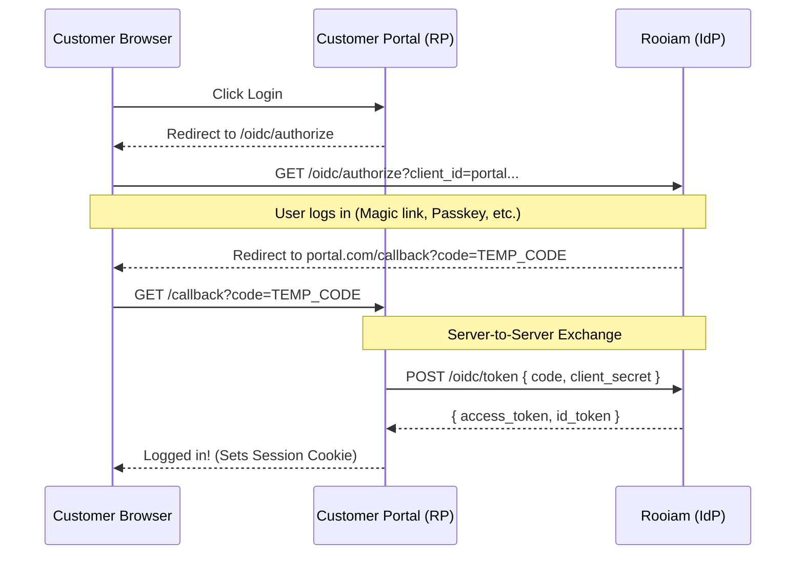

# Chapter 4: Social Logins

<span class="chapter-label">Chapter 4 — External Identities</span>

<p class="chapter-intro">
"Log in with Google" is one of the most common features in modern software — and one of the most
commonly misimplemented. This chapter dissects the OAuth 2.0 protocol, explains the account-takeover
attack that lurks inside a naive implementation, and shows how Rooiam blocks it with a junction table.
</p>

## 4.1 Why Social Login

Magic links require waiting for an email — typically 5–15 seconds if the mail server is fast, up to a minute on slow networks. For consumer applications, this delay is significant. Users who click "Log in" and are not authenticated within a few seconds often abandon the flow.

Social login eliminates this wait. The user clicks "Log in with Google," approves the request in a popup they've seen a hundred times, and lands back in the app in under two seconds. No email wait, no password to remember.

But social login introduces a new complexity: the server must accept identity claims from an *external party* (Google, Microsoft) and translate them into a local user identity. Done naively, this translation is exploitable.

## 4.2 The Account Takeover Attack

Here is the dangerous naive implementation:

```
Google tells us: "The user's email is ceo@bigcorp.com"
Our server looks up email in our database: found! Log them in.
```

This seems reasonable. Google verified the email, right?

The problem is the word "Google." The server trusts the *provider*, not just the *email*. Consider what happens when you add a second social provider — say, a smaller business identity service, or a custom corporate SSO.

If that second provider allows users to claim *any* email without verifying inbox ownership, an attacker can:

1. Register an account at the second provider claiming `ceo@bigcorp.com`.
2. Visit your login page and click "Log in with SecondProvider."
3. Your server receives: `{ email: "ceo@bigcorp.com" }` from SecondProvider.
4. Your server looks up `ceo@bigcorp.com` in the database, finds the CEO's account, and logs them in.

The attacker is now inside the CEO's account with full access. They never needed the CEO's password, and they never had access to the CEO's inbox.

This is an **Account Takeover via Cross-Provider Email Trust** and it is devastatingly common in applications that use email as the join key for social logins.

<div class="callout danger">
<div class="callout-title">⛔ Root Cause</div>

The mistake is trusting the email string from an external provider as proof of inbox ownership. It is only proof that the *provider* says this is the user's email. The provider might be wrong, unverified, or compromised.

</div>



## 4.3 The Subject Identifier: Provider-Scoped Identity

Every major OAuth provider assigns each user a permanent, internal numeric identifier called the **Subject** (`sub`). For example, Google might tell you:

```json
{
  "sub": "104829381047263849",
  "email": "ceo@bigcorp.com",
  "email_verified": true,
  "name": "Jane Smith"
}
```

The `sub` value `104829381047263849` is Google's internal ID for this specific person. It is:
- **Immutable** — it never changes, even if the user changes their email.
- **Provider-scoped** — the same person's Microsoft `sub` is a completely different string.
- **Unforgeable** — only Google's authorization server issues this value in a signed OAuth response.

The correct join key is not `email` — it is the combination of `(provider, sub)`. This tuple uniquely and unforgably identifies a person within a specific identity system.

## 4.4 The External Identities Table

Rooiam stores this mapping in a **junction table** — a bridge table that connects your internal users table to the external provider's identifier:



```sql
CREATE TABLE external_identities (
    id               UUID        PRIMARY KEY DEFAULT gen_random_uuid(),
    user_id          UUID        NOT NULL REFERENCES users(id) ON DELETE CASCADE,
    provider         VARCHAR(50)  NOT NULL,           -- 'google' | 'microsoft'
    provider_user_id VARCHAR(255) NOT NULL,           -- the "sub" value
    email            VARCHAR(255),                    -- stored for display only
    profile_json     JSONB        NOT NULL DEFAULT '{}',
    created_at       TIMESTAMPTZ  NOT NULL DEFAULT NOW()
);

-- The critical constraint: each (provider, sub) pair maps to exactly one user
CREATE UNIQUE INDEX idx_external_identities_provider_sub
    ON external_identities (provider, provider_user_id);
```

The `UNIQUE` index on `(provider, provider_user_id)` enforces the invariant: one Google account can only ever be linked to one Rooiam user. If an attacker tries to link the same Google account to a second Rooiam user, the database rejects the insert.

The login lookup now ignores the email entirely:

```sql
-- SECURE: join on (provider, sub), not on email
SELECT u.id, u.status
FROM external_identities ei
JOIN users u ON u.id = ei.user_id
WHERE ei.provider = 'google'
  AND ei.provider_user_id = '104829381047263849';  -- Google's sub value
```

Even if an attacker creates a second OAuth provider that claims any email, they cannot forge Google's `sub` value. The attack is completely blocked.

## 4.5 The OAuth 2.0 Flow

The actual protocol Rooiam uses to obtain the `sub` and email from Google is **OAuth 2.0 Authorization Code Flow**:


<p class="diagram-caption">Figure 4.1 — OAuth 2.0 Authorization Code Flow. The authorization code (short-lived, single-use) is exchanged server-to-server for the access token.</p>

**Why the indirection?** The browser carries the `code` in the URL — visible in history, logs, and referrer headers. By never putting the access token in the URL, and by exchanging the code in a direct server-to-server call, the sensitive credential never passes through the browser.

## 4.6 The State Token: CSRF Protection

Notice the `state` parameter in the OAuth flow. The server generates a random token before redirecting to Google, stores it in Redis, and includes it in the redirect URL. When Google redirects back, the server checks that the returned `state` matches what it stored.

This prevents **Cross-Site Request Forgery (CSRF)** in the OAuth flow. Without the state check, an attacker could craft a URL like:

```
https://yourapp.com/oauth/callback?code=attacker_code&state=anything
```

And trick your server into accepting an authorization code that belongs to the attacker's Google session — potentially logging you into *their* account. The state token binds the callback to the specific browser that initiated the flow.

Rooiam also binds the state token to the initiating IP address. A callback from a different IP than the one that started the flow is rejected.

## 4.7 Atomic User Creation

When a brand new user logs in via Google for the first time, the server must atomically create three records:
1. A `users` row (the UUID anchor).
2. A `user_emails` row (verified email from Google).
3. An `external_identities` row (the Google sub).

If any step fails, all three must be rolled back. Partial creation would leave orphaned records. Rooiam wraps all three inserts in a single **database transaction**:

```rust
// src/modules/identity/repository.rs

pub async fn create_user_from_oauth(
    pool: &PgPool,
    provider: &str,
    provider_user_id: &str,
    email: &str,
    display_name: Option<&str>,
    profile_json: serde_json::Value,
) -> Result<Uuid, AppError> {
    // BEGIN TRANSACTION — either all three inserts succeed, or none do
    let mut tx = pool.begin().await?;

    // 1. Create the UUID anchor
    let user_id: Uuid = sqlx::query_scalar(
        "INSERT INTO users (display_name) VALUES ($1) RETURNING id"
    )
    .bind(display_name)
    .fetch_one(&mut *tx).await?;

    // 2. Attach the email (pre-verified by Google — email_verified: true)
    sqlx::query(
        "INSERT INTO user_emails (user_id, email, is_primary, is_verified, verified_at)
         VALUES ($1, $2, true, true, NOW())"
    )
    .bind(user_id).bind(email)
    .execute(&mut *tx).await?;

    // 3. Bind Google's subject ID to our UUID
    sqlx::query(
        "INSERT INTO external_identities
         (user_id, provider, provider_user_id, email, profile_json)
         VALUES ($1, $2, $3, $4, $5)"
    )
    .bind(user_id).bind(provider).bind(provider_user_id)
    .bind(email).bind(&profile_json)
    .execute(&mut *tx).await?;

    // COMMIT — all three rows are now permanently saved
    tx.commit().await?;

    Ok(user_id)
}
```

If step 2 or 3 fails (e.g., a duplicate email conflict), the entire transaction is rolled back. No partial user records, no orphaned anchors.

---

<div class="summary-box">
<div class="summary-box-title">Chapter Summary</div>

- Never use `email` from an OAuth provider as a join key — it is only the provider's claim, not proof of inbox ownership.
- Use the **`(provider, sub)` tuple** as the immutable, provider-scoped identifier. The `sub` value cannot be forged across providers.
- The `external_identities` junction table bridges your internal UUID to the external provider's subject ID.
- A **UNIQUE constraint on `(provider, provider_user_id)`** ensures one Google account maps to exactly one Rooiam user.
- **OAuth state tokens** stored in Redis prevent CSRF attacks that could log users into wrong accounts.
- **Database transactions** ensure user creation is atomic — all three records succeed or none do.

</div>

---

<div class="exercises">
<div class="exercises-title">Exercises</div>

1. A user signs up via Google with `ceo@bigcorp.com`. Later, an attacker creates a separate OAuth provider that sends `{ email: "ceo@bigcorp.com" }`. Walk through the database lookup for this second login attempt. At exactly which query does it fail to find a matching `external_identities` row?

2. The state token is stored in Redis with a 10-minute TTL. What happens if a user starts a Google login on one browser tab, waits 15 minutes, then completes the flow? What error does Rooiam return? Is this a security decision or just a UX detail?

3. Find where `email_verified: true` from the Google profile is checked in the codebase. What happens if Google returns `email_verified: false`? Should Rooiam create the user anyway? What risk does this create?

4. The `profile_json` column stores the full provider profile as JSONB. Name two situations where having the full profile stored is useful. Name one privacy risk.

5. What prevents an attacker from simply forging the `code` parameter in the callback URL? (Hint: the code is short-lived and can only be exchanged once by a server holding the correct `client_secret`.)

</div>
