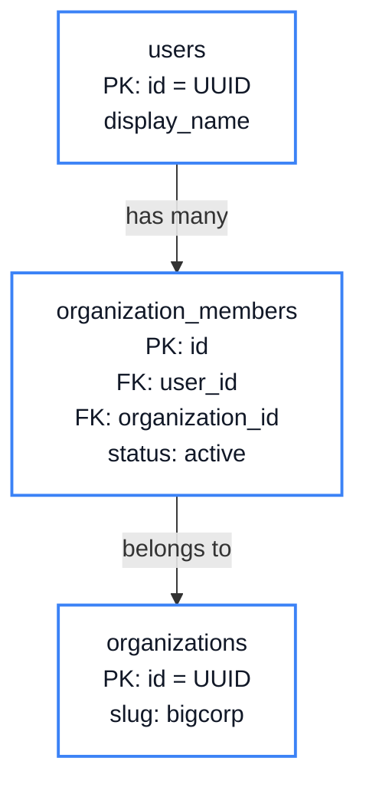
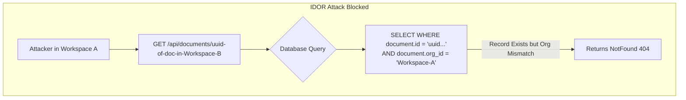

# Chapter 5: Multi-Tenant Architecture

<span class="chapter-label">Chapter 5 — Control Plane</span>

<p class="chapter-intro">
Enterprise software must serve many companies simultaneously — each with its own users, roles,
and security policies — without any company seeing another's data. This chapter explains the
multi-tenant architecture that makes this possible, and why the naive approach of adding a
"role" column to the users table is fundamentally broken.
</p>

## 5.1 B2C vs B2B: Different Data Models

Most beginner tutorials teach **B2C (Business to Consumer)** patterns — one global pool of users, each managing their own profile. Think of Netflix: there is one platform, all users are equal, and any user can see the same public content.

Enterprise software is **B2B (Business to Business)**. Think Slack: each company gets its own workspace. Data is completely isolated between workspaces. Users belong to specific companies, have different roles in different workspaces, and company administrators set security rules that their employees must follow.

A Slack user might be the workspace administrator for their own consulting business but only a read-only viewer in a client's workspace. These two roles exist simultaneously for the same human.

## 5.2 Why a `role` Column on the User Fails

The beginner's instinct is to add a role field directly to the user:

```sql
-- Broken multi-tenant approach
ALTER TABLE users ADD COLUMN role VARCHAR(50) DEFAULT 'member';
```

Now `users.role = 'admin'` means the user is an admin. But where? For which company? The column has no workspace context.

In Rooiam, user `f47ac10b` might be:
- `admin` in the `bigcorp` workspace
- `viewer` in the `startupco` workspace
- `owner` in their own `freelance` workspace

If their role is stored on the `users` row, the server cannot distinguish these. Worse, any endpoint that checks `user.role == 'admin'` would grant admin privileges across *all* workspaces simultaneously.

> **The Golden Rule of Multi-Tenancy**: Privilege is never a property of the user. Privilege is a property of the *relationship* between a user and a specific workspace.

## 5.3 The Three-Table Architecture

Rooiam models multi-tenancy with three tables:



The `organization_members` table is a **bridge table** — it records the relationship between a user and a workspace, and acts as the anchor point for roles in that relationship:

```sql
-- The workspace entity
CREATE TABLE organizations (
    id      UUID        PRIMARY KEY DEFAULT gen_random_uuid(),
    name    VARCHAR(255) NOT NULL,
    slug    VARCHAR(100) UNIQUE NOT NULL,  -- e.g., 'bigcorp'
    status  VARCHAR(20)  NOT NULL DEFAULT 'active',

    -- Authentication policy for this workspace
    allow_magic_link  BOOLEAN NOT NULL DEFAULT true,
    allow_google      BOOLEAN NOT NULL DEFAULT true,
    allow_microsoft   BOOLEAN NOT NULL DEFAULT true,
    allow_passkey     BOOLEAN NOT NULL DEFAULT true,
    require_mfa       BOOLEAN NOT NULL DEFAULT false,

    -- Domain restriction: only emails ending in these domains may join
    allowed_email_domains VARCHAR(500) NOT NULL DEFAULT '',

    -- Session policy
    max_session_age_hours    INTEGER,
    max_concurrent_sessions  INTEGER,

    created_at TIMESTAMPTZ NOT NULL DEFAULT NOW()
);

-- The privilege bridge
CREATE TABLE organization_members (
    id              UUID        PRIMARY KEY DEFAULT gen_random_uuid(),
    organization_id UUID        NOT NULL REFERENCES organizations(id) ON DELETE CASCADE,
    user_id         UUID        NOT NULL REFERENCES users(id) ON DELETE CASCADE,
    status          VARCHAR(20)  NOT NULL DEFAULT 'active',
    created_at      TIMESTAMPTZ  NOT NULL DEFAULT NOW(),
    UNIQUE (organization_id, user_id)  -- one membership per user per org
);
```

A user's role in a workspace is stored in the `roles` table system (covered in Chapter 8) and associated with the `organization_members` row. The key insight: the `users` table has no role column at all.

## 5.4 Context Injection

When a user makes a request, the session middleware extracts not just their user ID but their **workspace context** — which organization they are currently viewing, and what role they hold there.

The `sessions` table stores `current_org_id`. When a user logs into a workspace, this is set. When they switch workspaces, it is updated. The Rust session middleware extracts this into the `ActiveSession` struct:

```rust
pub struct ActiveSession {
    pub session_id:      Uuid,
    pub user_id:         Uuid,
    pub current_org_id:  Option<Uuid>,   // ← which workspace is active
    pub is_superuser:    bool,
    pub is_platform_owner: bool,
    // ...
}
```

Every API handler that performs a workspace-scoped operation receives this struct via Actix-web's **extractor** system. The handler does not look up the user's role from scratch — it is already in the `ActiveSession`.

## 5.5 The Auth Policy Engine

One of the most powerful features of multi-tenancy is **per-workspace auth policy**. Each company can control exactly how its employees are allowed to log in.

Consider a bank using Rooiam. The bank's security policy might be:
- Magic links are disabled (too phishable for banking).
- Only Microsoft login is allowed (employees use corporate Azure AD).
- MFA is required for all users.
- Sessions expire after 8 hours.

None of these restrictions affect any other workspace on the platform.

Rooiam enforces this via the `ensure_auth_method_allowed` function, called at the start of every login flow:

```rust
// src/shared/auth_policy.rs

pub async fn ensure_auth_method_allowed(
    pool: &PgPool,
    redirect_uri: Option<&str>,   // used to identify which workspace is logging in
    method: AuthMethod,           // MagicLink | Google | Microsoft | Passkey
) -> Result<Option<Organization>, AppError> {
    // 1. Determine which workspace is being logged into
    //    (extracted from redirect_uri domain or workspace slug)
    let org = resolve_org_from_redirect(pool, redirect_uri).await?;

    let Some(ref o) = org else {
        return Ok(None); // No org context = platform-level login, no restrictions
    };

    // 2. Check the method against org policy
    let allowed = match method {
        AuthMethod::MagicLink  => o.allow_magic_link,
        AuthMethod::Google     => o.allow_google,
        AuthMethod::Microsoft  => o.allow_microsoft,
        AuthMethod::Passkey    => o.allow_passkey,
    };

    if !allowed {
        return Err(AppError::Validation(
            format!("This login method is not enabled for this workspace.")
        ));
    }

    // 3. Check workspace status
    if o.status == "suspended" {
        return Err(AppError::Validation(
            "This workspace has been suspended.".into()
        ));
    }

    Ok(org)
}
```

This function is called before generating a magic link, before redirecting to Google, and before processing a passkey assertion. The workspace policy is enforced at the entrance to every login method, not deep inside the flow.

## 5.6 The Organization Data Model in Rust

The `Organization` struct in Rust mirrors the full policy surface area of the organizations table:

```rust
// src/modules/organization/models.rs (abridged)

pub struct Organization {
    pub id:   Uuid,
    pub name: String,
    pub slug: String,

    // Auth policy
    pub allow_magic_link:  bool,
    pub allow_google:      bool,
    pub allow_microsoft:   bool,
    pub allow_passkey:     bool,
    pub require_mfa:       bool,

    // Domain restriction (comma-separated, e.g. "bigcorp.com,partner.com")
    pub allowed_email_domains: String,

    // Session policy
    pub max_session_age_hours:   Option<i32>,
    pub max_concurrent_sessions: Option<i32>,

    // Status
    pub status:          String,   // "active" | "suspended"
    pub platform_locked: bool,     // true = tenant cannot re-activate
}
```

## 5.7 IDOR Prevention via Context Binding

In a multi-tenant system, one of the most dangerous bugs is an **IDOR (Insecure Direct Object Reference)** — when a user in workspace A can access or modify records in workspace B by guessing their IDs.

Rooiam prevents this by binding every database query to the current organization. Even if a request supplies the ID of a record in another workspace, the query automatically injects an `AND organization_id = $current_org_id` clause.



```rust
// Example: delete an API key
pub async fn delete_api_key(
    pool: &PgPool,
    session: &ActiveSession,
    key_id: Uuid,
) -> Result<(), AppError> {
    // The AND organization_id clause is the security boundary.
    // Even if key_id belongs to another workspace, the query finds nothing.
    let rows_affected = sqlx::query!(
        "DELETE FROM api_keys
         WHERE id = $1
           AND organization_id = $2",
        key_id,
        session.current_org_id    // ← bound to the current session's workspace
    )
    .execute(pool)
    .await?
    .rows_affected();

    if rows_affected == 0 {
        return Err(AppError::NotFound("API key not found.".into()));
    }
    Ok(())
}
```

An attacker who guesses another workspace's API key UUID gets `NotFound` — identical to the response for a key that simply doesn't exist. No information leakage, no access granted.

---

<div class="summary-box">
<div class="summary-box-title">Chapter Summary</div>

- **B2B multi-tenancy** requires per-workspace data isolation. A user can have different roles in different workspaces simultaneously.
- **Never store role on the user** — store it on the membership relationship (`organization_members`) instead.
- `organizations` stores the security policy for each workspace: which login methods are allowed, MFA requirements, session limits, domain restrictions.
- The **auth policy engine** (`ensure_auth_method_allowed`) checks workspace policy before every login attempt.
- **IDOR prevention** is enforced by binding every query to `AND organization_id = $current_org_id` — an ID from another workspace resolves to `NotFound`.
- The `platform_locked` flag lets platform administrators hard-lock a workspace that tenant admins cannot unlock.

</div>

---

<div class="exercises">
<div class="exercises-title">Exercises</div>

1. A user is a member of two workspaces: `bigcorp` (where they are `admin`) and `startupco` (where they are `viewer`). Draw the rows that would exist in `organization_members` for this user. What column prevents them from having more than one membership row per workspace?

2. The `allowed_email_domains` column is a comma-separated string like `"bigcorp.com,partner.com"`. Where in the codebase is this string parsed and checked? Write a pseudocode check that validates whether `jane@partner.com` is allowed to join the `bigcorp` workspace.

3. Trace what happens when a user calls `PATCH /v1/orgs/current/auth-policy` to disable `allow_magic_link` while they themselves only have magic link as their login method. (Hint: look at the `self-check` endpoint added in Phase 6.)

4. The `platform_locked` boolean exists alongside `status`. Why are two separate fields needed? What does `status = 'suspended'` mean vs `platform_locked = true`? Who can set each?

</div>
