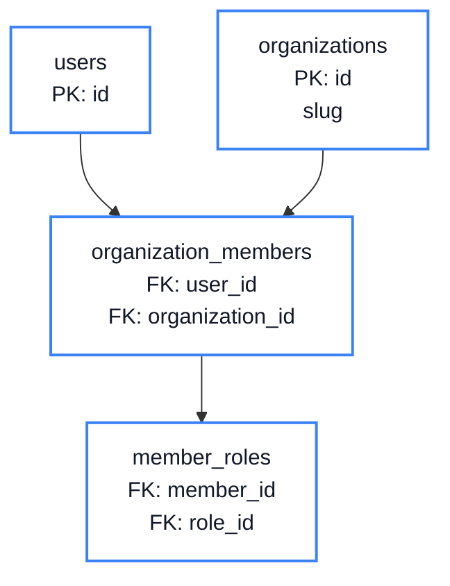

# Chapter 5: Multi-Tenant Organizations

A user may belong to several customer workspaces with different permissions and authentication policies. Rooiam represents these relationships explicitly rather than placing one workspace role on the user record.

## Membership is a relationship

`organizations` stores workspaces. `organization_members` joins `organization_id` to `user_id`, with a unique pair and membership `status`. Role assignments live in `member_roles`, which joins a membership to `roles`.

```mermaid
flowchart TD
    users["users<br/>PK: id"]
    orgs["organizations<br/>PK: id<br/>slug"]
    members["organization_members<br/>FK: user_id<br/>FK: organization_id"]
    assignments["member_roles<br/>FK: member_id<br/>FK: role_id"]
    users --> members
    orgs --> members
    members --> assignments
    classDef table fill:#ffffff,stroke:#3b82f6,stroke-width:2px,color:#111827;
    class users,orgs,members,assignments table;
```

The diagram shows why changing one membership's role does not change that user's role in every workspace.

## Policy has context

Workspace fields include `allow_magic_link`, `allow_google`, `allow_microsoft`, `allow_passkey`, `require_mfa`, and `allowed_email_domains`. The email-domain list is comma-separated text, not a PostgreSQL array.

`get_workspace_policy_for_redirect` first looks up an exact registered OAuth redirect URI, then can resolve workspace context from a first-party redirect. Other flows supply an explicit workspace ID. `ensure_auth_method_allowed` checks the selected method; account/workspace status and other constraints are handled by additional policy and login code.

A missing workspace context does not mean all platform policies disappear. Operator, tenant-portal, and downstream workspace login are distinct surfaces.

## Tenant boundaries are explicit checks

A random UUID is not authorization. Handlers and repositories must check membership, permission, and the target record's workspace. SQL does not automatically inject tenant filters into every query, and Rooiam does not claim a universal row-level-security boundary.

For machine integrations, the workspace is derived from the API key. For human sessions, `current_org_id` supplies context that still requires appropriate authorization checks. A platform user's operator powers and workspace-management rules are handled separately.

## Current limits

Workspace governance defaults to five workspaces per user and five apps per workspace. Demo governance uses five workspaces and ten apps per workspace. Platform and per-user settings can affect the effective limits; inspect the governance code instead of treating a UI count as a universal constant.

## Exercises

1. Draw a user who is owner in one workspace and member in another.
2. Trace an API-key member operation and find where its workspace ID originates.
3. Find the checks that prevent a tenant from undoing a platform lock.

## Follow the source

- [rooiam-server/migrations/0001_init.sql](https://github.com/theparitt/rooiam/blob/c20b9edfa8ce23649fd9107b35f9f20e1251b39b/rooiam-server/migrations/0001_init.sql)
- [rooiam-server/src/shared/auth_policy.rs](https://github.com/theparitt/rooiam/blob/c20b9edfa8ce23649fd9107b35f9f20e1251b39b/rooiam-server/src/shared/auth_policy.rs)
- [rooiam-server/src/shared/tenant_access.rs](https://github.com/theparitt/rooiam/blob/c20b9edfa8ce23649fd9107b35f9f20e1251b39b/rooiam-server/src/shared/tenant_access.rs)
- [rooiam-server/src/shared/workspace_governance.rs](https://github.com/theparitt/rooiam/blob/c20b9edfa8ce23649fd9107b35f9f20e1251b39b/rooiam-server/src/shared/workspace_governance.rs)
- [rooiam-server/src/modules/organization/handlers.rs](https://github.com/theparitt/rooiam/blob/c20b9edfa8ce23649fd9107b35f9f20e1251b39b/rooiam-server/src/modules/organization/handlers.rs)
