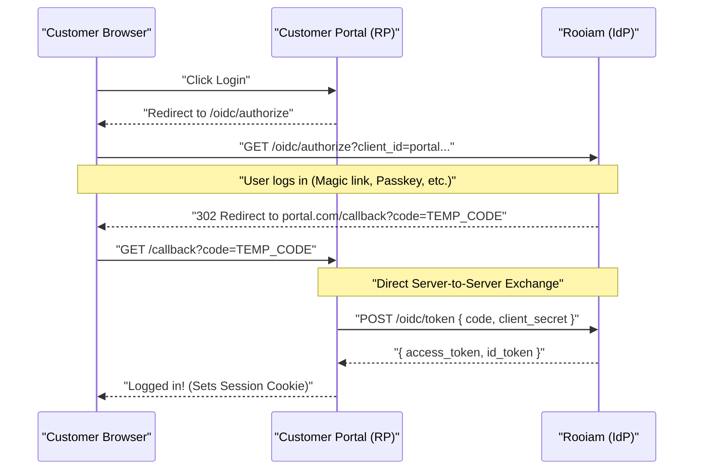
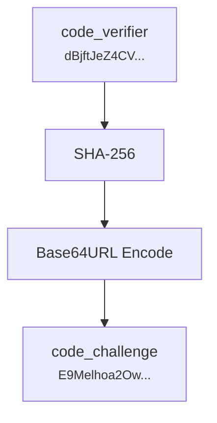
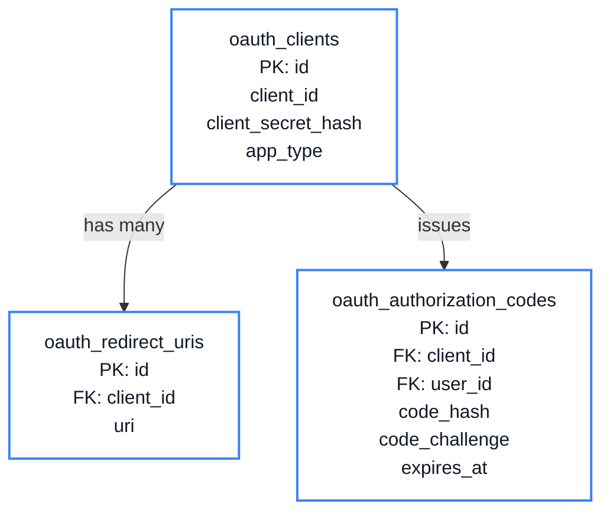

# Chapter 6: The OIDC Provider

<span class="chapter-label">Chapter 6 — Protocol Layer</span>

<p class="chapter-intro">
A company doesn't have just one application. It has a website, a mobile app, a billing dashboard,
an internal admin tool. If every app reimplements login independently, the result is duplicated
code, inconsistent security, and frustrated users logging in five times a day. OpenID Connect
solves this by making Rooiam the central, trusted security authority for the entire application
ecosystem.
</p>

## 6.1 The Ecosystem Problem

Imagine `BigCorp` has three applications:
- A public-facing customer portal (React SPA)
- A mobile app (iOS + Android)
- A third-party billing dashboard built by `BillingCo`

Without a central identity authority, each app would need to implement its own login system. The customer portal would maintain its own password database. The mobile app would have its own session management. And `BillingCo`'s billing dashboard — which BigCorp does not control — would need to see BigCorp's users' passwords directly to authenticate them. This is absurd and dangerous.

**OpenID Connect (OIDC)** solves this. OIDC defines a standard protocol where:
- Rooiam is the **Identity Provider (IdP)** — the single source of truth for user identities.
- The portal, mobile app, and billing dashboard are **Relying Parties (RPs)** — they delegate all authentication to Rooiam and receive a signed token as proof.

No RP ever sees a password. No RP ever stores credentials. They only receive the minimum information they need: a user ID, an email address, a name.

## 6.2 The Authorization Code Flow

OIDC's primary protocol is the **Authorization Code Flow**. Here is the complete sequence:


<p class="diagram-caption">Figure 6.1 — The Authorization Code Flow. The authorization code travels through the browser (URL), but the tokens are exchanged server-to-server.</p>

The key security insight: the `code` travels through the browser URL — visible in logs and history. But the `code` alone is useless. The portal's backend server must exchange it for tokens in a direct server-to-server call, authenticating itself with its `client_secret`. An attacker who sees the code in a URL cannot redeem it without also possessing the client secret.

## 6.3 PKCE: Protecting Public Clients

Mobile apps and single-page applications (SPAs) cannot safely store a `client_secret` — the app's code is downloadable and readable. These are called **public clients**.

For public clients, OIDC defines **PKCE** (Proof Key for Code Exchange, pronounced "pixy"):

1. **Before the redirect**, the client generates a random `code_verifier` (e.g., 96 random bytes, base64url-encoded).
2. It computes `code_challenge = BASE64URL(SHA-256(code_verifier))`.
3. The `code_challenge` is sent in the initial authorization request.
4. Rooiam stores `code_challenge` alongside the authorization code.
5. When the client exchanges the code for tokens, it sends the original `code_verifier`.
6. Rooiam recomputes `SHA-256(code_verifier)` and compares it to the stored `code_challenge`.



If an attacker intercepts the `code` from the browser URL, they cannot exchange it — they don't have the `code_verifier` that only the legitimate client knows.

## 6.4 The Database Tables

Two tables support the OIDC flow representing the Clients (Relying Parties) and the Authorization Codes.



```sql
-- Registered applications (Relying Parties)
CREATE TABLE oauth_clients (
    id           UUID        PRIMARY KEY DEFAULT gen_random_uuid(),
    org_id       UUID        REFERENCES organizations(id),
    client_id    VARCHAR(100) UNIQUE NOT NULL,   -- public identifier
    -- client_secret is stored as Argon2id hash (same as passwords)
    client_secret_hash VARCHAR(255),             -- NULL for public clients
    app_name     VARCHAR(255) NOT NULL,
    app_type     VARCHAR(20)  NOT NULL,          -- 'web' | 'spa' | 'native'
    status       VARCHAR(20)  NOT NULL DEFAULT 'active',
    is_first_party BOOLEAN    NOT NULL DEFAULT false,
    created_at   TIMESTAMPTZ  NOT NULL DEFAULT NOW()
);

CREATE TABLE oauth_redirect_uris (
    id        UUID PRIMARY KEY DEFAULT gen_random_uuid(),
    client_id UUID NOT NULL REFERENCES oauth_clients(id) ON DELETE CASCADE,
    uri       VARCHAR(512) NOT NULL
);

-- Short-lived authorization codes (5-minute TTL, single-use)
CREATE TABLE oauth_authorization_codes (
    id              UUID        PRIMARY KEY DEFAULT gen_random_uuid(),
    client_id       UUID        NOT NULL REFERENCES oauth_clients(id),
    user_id         UUID        NOT NULL REFERENCES users(id),
    org_id          UUID        REFERENCES organizations(id),
    code_hash       VARCHAR(64)  NOT NULL UNIQUE,  -- SHA-256 of the raw code
    redirect_uri    VARCHAR(512) NOT NULL,
    scope           VARCHAR(255),
    nonce           VARCHAR(255),
    code_challenge  VARCHAR(255),                  -- PKCE challenge (base64url SHA-256)
    code_challenge_method VARCHAR(10),             -- 'S256'
    expires_at      TIMESTAMPTZ  NOT NULL,
    used_at         TIMESTAMPTZ
);
```

Authorization codes follow the same hash-store pattern as magic links: the raw code travels in the browser redirect URL, but only its SHA-256 hash is stored in the database.

## 6.5 The Discovery Document

OIDC clients need to know where to find Rooiam's authorization, token, and JWKS endpoints. Rather than hardcoding these, OIDC defines a **Discovery Document** — a JSON endpoint at a well-known URL:

```
GET /.well-known/openid-configuration
```

Rooiam returns:

```json
{
  "issuer": "https://auth.example.com",
  "authorization_endpoint": "https://auth.example.com/v1/oidc/authorize",
  "token_endpoint": "https://auth.example.com/v1/oidc/token",
  "userinfo_endpoint": "https://auth.example.com/v1/oidc/userinfo",
  "jwks_uri": "https://auth.example.com/.well-known/jwks.json",
  "end_session_endpoint": "https://auth.example.com/v1/oidc/end-session",
  "response_types_supported": ["code"],
  "subject_types_supported": ["public"],
  "id_token_signing_alg_values_supported": ["RS256"],
  "scopes_supported": ["openid", "email", "profile"],
  "code_challenge_methods_supported": ["S256"]
}
```

Any OIDC-compliant client library (NextAuth, oauth2-proxy, AppAuth) can configure itself from this single URL. Add Rooiam's URL, and the client auto-discovers everything it needs.

## 6.6 JWT Tokens and JWKS

When the token endpoint issues an access token or ID token, it is a **JSON Web Token (JWT)** signed with Rooiam's RSA private key. Any RP can verify this token's authenticity using Rooiam's public key, published at the **JWKS endpoint**:

```
GET /.well-known/jwks.json
```

```json
{
  "keys": [{
    "kty": "RSA",
    "use": "sig",
    "kid": "rooiam-20260317143022",
    "alg": "RS256",
    "n": "0vx7agoebGcQSuuPiLJXZptN9n...",
    "e": "AQAB"
  }]
}
```

The `kid` (Key ID) in the JWT header tells the verifier which public key to use for verification. This enables **key rotation** — when Rooiam rotates its signing key, the old key remains in the JWKS for a configurable rollover window (default 24 hours) so that tokens issued before the rotation remain valid until they expire.

## 6.7 The Token Exchange in Rust

The most complex part of the OIDC flow — the token exchange — happens in `src/modules/oidc/handlers.rs`:

```rust
// Simplified token endpoint handler
async fn token(
    state: web::Data<AppState>,
    body: web::Form<TokenRequest>,
) -> Result<HttpResponse, AppError> {
    match body.grant_type.as_str() {
        "authorization_code" => {
            // 1. Hash the submitted code
            let code_hash = sha256_hex(&body.code.as_deref().unwrap_or(""));

            // 2. Look up the code — must exist, not expired, not used
            let auth_code = oidc_service
                .exchange_code(&code_hash, &body.client_id, &body.redirect_uri)
                .await?;

            // 3. PKCE verification — for public clients
            if let Some(challenge) = &auth_code.code_challenge {
                let verifier = body.code_verifier.as_deref()
                    .ok_or(AppError::OAuthError("invalid_grant", "code_verifier required"))?;
                let computed = base64url_sha256(verifier);
                if computed != *challenge {
                    return Err(AppError::OAuthError("invalid_grant", "PKCE verification failed"));
                }
            }

            // 4. Issue JWT access token (RS256, 1-hour expiry)
            let access_token = oidc_service
                .issue_access_token(&state.db, &state.config, auth_code.user_id, &auth_code)
                .await?;

            // 5. Issue ID token (contains sub, email, name, nonce)
            let id_token = oidc_service
                .issue_id_token(&state.db, &state.config, &auth_code, &access_token)
                .await?;

            // 6. Issue refresh token (30-day, stored as hash)
            let refresh_token = oidc_service
                .issue_refresh_token(&state.db, auth_code.user_id, &auth_code)
                .await?;

            Ok(HttpResponse::Ok().json(TokenResponse {
                access_token,
                token_type: "Bearer".into(),
                expires_in: 3600,
                id_token: Some(id_token),
                refresh_token: Some(refresh_token),
            }))
        }
        "refresh_token" => { /* ... */ }
        _ => Err(AppError::OAuthError("unsupported_grant_type", "...")),
    }
}
```

---

<div class="summary-box">
<div class="summary-box-title">Chapter Summary</div>

- **OIDC** makes Rooiam the central authentication authority. Applications (Relying Parties) never handle passwords or credentials directly.
- The **Authorization Code Flow** separates the browser-visible code (low-value, short-lived) from the server-side token exchange (high-value, protected by `client_secret`).
- **PKCE** extends the flow to public clients (SPAs, mobile apps) that cannot hold a `client_secret` securely.
- **Authorization codes** are stored as SHA-256 hashes, used exactly once, and expire in 5 minutes.
- The **Discovery Document** lets any OIDC client library auto-configure from a single URL.
- **JWKS** publishes Rooiam's signing public key; the `kid` header enables key rotation without breaking existing tokens.

</div>

---

<div class="exercises">
<div class="exercises-title">Exercises</div>

1. An attacker intercepts the authorization code from the browser redirect URL. They try to exchange it using the `/oidc/token` endpoint. What two checks prevent them from succeeding? (Hint: what information do they lack that the legitimate RP server has?)

2. A mobile app generates `code_verifier = "hello"`. Why is this catastrophically insecure? What property of the verifier is required for PKCE to be secure?

3. Inspect the Discovery Document by running the server and visiting `/.well-known/openid-configuration`. Find the `end_session_endpoint`. What does this endpoint do, and which OIDC specification section requires it?

4. The `sub` claim in the ID token must be a permanent, opaque identifier. Should Rooiam use the user's UUID directly as `sub`, or should it use a workspace-scoped value? What are the privacy and portability trade-offs of each approach?

5. A refresh token has a 30-day TTL. If a user's account is suspended by an administrator, can they still use a valid refresh token to get a new access token? Where in the code does Rooiam check this? Find the relevant query.

</div>
