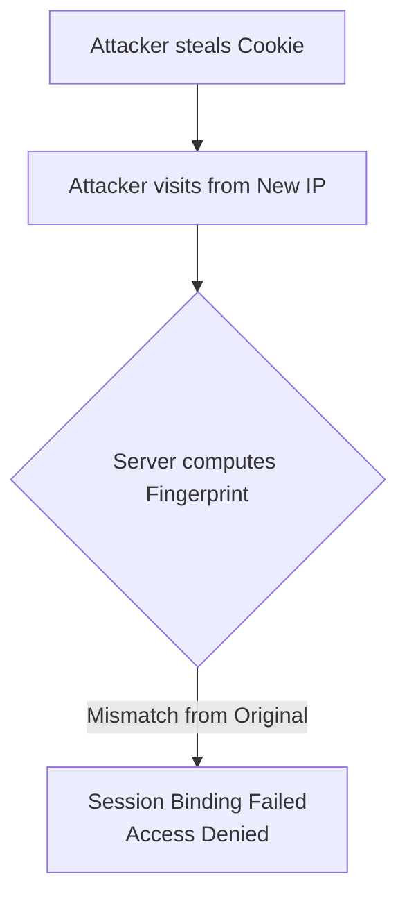
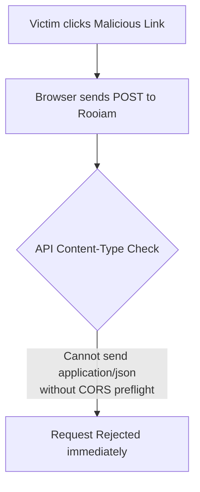

# Chapter 7: Threat Modeling

<span class="chapter-label">Chapter 7 — Security Architecture</span>

<p class="chapter-intro">
An identity server is the highest-value target in any application. Compromising it grants access
to every user's account, every workspace, every piece of data. This chapter catalogs the most
common attack patterns against IAM systems and shows exactly how Rooiam's architecture defeats
each one.
</p>

## 7.1 What Is Threat Modeling?

Threat modeling is the discipline of systematically asking: *what are all the ways this system can be attacked, and what can we do to prevent or detect each one?*

For each threat, we evaluate:
- **Who is the attacker?** (Outsider, malicious insider, compromised dependency)
- **What is the attack vector?** (Network request, database access, browser exploit)
- **What is the impact?** (One account compromised, many accounts, full platform takeover)
- **What is the countermeasure?** (Technical control, process control, detection)

We organize threats into categories. Rooiam addresses seven major categories.

## 7.2 Threat 1: Cookie Theft via XSS

**Attack**: An attacker injects malicious JavaScript into a page (e.g., via a stored XSS vulnerability in a user's display name or a chat message). When another user views the page, the script runs and executes `document.cookie` to steal the session cookie.

**Impact**: Full session takeover. The attacker logs in as the victim.

**Countermeasure — `HttpOnly` flag**:

When Rooiam sets the session cookie, it includes the `HttpOnly` flag:

```
Set-Cookie: rooiam_sid=a8f2c9e1...; HttpOnly; Secure; SameSite=None; Path=/
```

The `HttpOnly` flag instructs the browser: *"Never expose this cookie to JavaScript."* Any call to `document.cookie` will not include `rooiam_sid`. The XSS script steals nothing.

**Countermeasure — Content Security Policy**:

A strict `Content-Security-Policy` header instructs browsers to reject inline scripts, limiting the surface area for XSS injection.

**Residual risk**: An attacker with network-level access (e.g., a man-in-the-middle on unencrypted HTTP) could still intercept the cookie. The `Secure` flag ensures the cookie is *only* transmitted over HTTPS.

## 7.3 Threat 2: Session Hijacking (Cookie Theft Without XSS)

**Attack**: An attacker physically steals a cookie — from a browser's local storage file, from a network packet on an unencrypted WiFi network, or by reading the victim's screen. They place the cookie in their own browser and access the account from a different country.

**Impact**: Full session takeover from a different geographic location.



**Countermeasure — Session Fingerprinting**:

When a session is created, Rooiam records:
```
fingerprint = SHA-256( device_class + "/" + ip_subnet_16 )
```

On every request, the server recomputes this fingerprint and compares it to the stored value. A significant change — e.g., from `"desktop/chrome/184.1"` to `"mobile/firefox/82.4"` — triggers a `auth.session.binding_mismatch` audit event.

The server can be configured to automatically revoke the session on a fingerprint mismatch, or to simply log the event for manual review.

**Countermeasure — `SameSite=None` with `Secure`**:

`SameSite=None` allows the cookie to be sent on cross-origin requests (necessary for OIDC flows where the browser navigates from a RP domain to the Rooiam domain). But `Secure` ensures it only ever travels over HTTPS, protecting it from passive network interception.

## 7.4 Threat 3: IDOR (Insecure Direct Object Reference)

**Attack**: In a multi-tenant system, a user in workspace A guesses the UUID of a record belonging to workspace B and makes a direct API call. If the server only checks that the record exists (not *who owns it*), the attacker can access or modify another company's data.

**Impact**: Cross-tenant data breach.

**Countermeasure — Workspace Binding**:

Every data-modifying query in Rooiam includes an `AND organization_id = $current_org_id` clause:

```rust
sqlx::query!(
    "DELETE FROM api_keys WHERE id = $1 AND organization_id = $2",
    key_id,
    session.current_org_id  // ← always the session's workspace, never caller-supplied
)
```

The `organization_id` in the query is never taken from the request body — it always comes from the validated, server-side session. An attacker who supplies a different `organization_id` in the request body cannot affect it; the server ignores that value and uses its own trusted source.

A non-existent or cross-tenant record returns `NotFound` — identical to the response for a record that genuinely doesn't exist. This prevents information leakage (the attacker cannot distinguish "wrong workspace" from "doesn't exist").

## 7.5 Threat 4: Email Enumeration

**Attack**: An attacker runs a script that submits thousands of email addresses to the `POST /v1/auth/magic-link/start` endpoint. If the server returns `"Error: email not found"` for unknown emails and `"Success: link sent"` for known emails, the attacker builds a list of all registered users.

**Impact**: Targeted phishing, credential stuffing, privacy violation.

**Countermeasure — Anti-Enumeration Response**:

Rooiam *always* returns the same response for the magic link start endpoint:

```json
{ "ok": true, "message": "If the email is valid, a magic link has been sent." }
```

This response is returned whether the email is registered or not. The server may silently discard the request for unknown emails, but the HTTP response is identical. An attacker cannot distinguish registered from unregistered users.

**Countermeasure — Rate Limiting**:

Failed login verification attempts (bad magic link tokens, wrong TOTP codes) increment a Redis counter keyed on the source IP:

```
Key:   security:failed_login:203.0.113.47
Value: 7  (incremented on each failure)
TTL:   600 seconds (resets after 10 minutes of no failures)
```

When the counter reaches a threshold (default: 5 failures), Rooiam writes a `auth.login.suspicious` audit event. At higher thresholds, it temporarily blocks the IP.

## 7.6 Threat 5: CSRF on State-Changing Requests

**Attack**: An attacker tricks a logged-in user into clicking a link that makes an authenticated state-changing request to Rooiam — for example, deleting their account or changing their email.

**Impact**: Unauthorized data modification.



**Countermeasure — `SameSite=None` + origin checks**:

The `SameSite=None` cookie attribute allows cross-origin requests for the OIDC flow but does not protect against CSRF on same-origin requests. Rooiam's API is a JSON API — it only processes requests with `Content-Type: application/json`. Browsers do not send `Content-Type: application/json` in cross-origin requests without an explicit CORS preflight, which Rooiam can reject for disallowed origins.

**Countermeasure — OAuth state tokens**:

For the OAuth flow specifically, the state token (stored in Redis and bound to the initiating IP) prevents an attacker from forging the callback redirect.

## 7.7 Threat 6: Replay Attacks

**Attack**: An attacker captures a valid token (magic link, authorization code, MFA code) and reuses it after the legitimate user has already used it.

**Impact**: Unauthorized authentication.

**Countermeasure — Single-Use Tokens**:

Every one-time-use token in Rooiam has a `used_at` column. On use, the server atomically marks the token used before processing it:

```sql
-- Atomic find-and-mark in a single transaction
UPDATE magic_links
SET used_at = NOW()
WHERE token_hash = $1
  AND used_at IS NULL
  AND expires_at > NOW()
RETURNING id, email, redirect_uri;
```

If `used_at` is already set (because the legitimate user already clicked the link), this query returns zero rows. The server returns `401 Unauthorized`. A replayed token is permanently dead after its first use.

## 7.8 Threat 7: Privilege Escalation

**Attack**: A regular user (role: `member`) tries to call an API endpoint that requires `admin` privileges — for example, `DELETE /v1/orgs/current/members/{id}` to remove another user.

**Impact**: Unauthorized administrative action.

**Countermeasure — Permission Checks on Every Handler**:

Every route handler in Rooiam that performs a privileged action calls an explicit permission check:

```rust
async fn remove_member(
    req: HttpRequest,
    state: web::Data<AppState>,
    path: web::Path<Uuid>,
) -> Result<HttpResponse, AppError> {
    let session = extract_session(&req)?;

    // Check membership + role in one query
    ensure_org_permission(&state.db, session.user_id, session.current_org_id, "members:manage")
        .await?;

    // ... proceed with removal
}
```

If the user does not have the `members:manage` permission in their current workspace, `ensure_org_permission` returns `Err(AppError::Forbidden)` and the handler returns `403 Forbidden` immediately. The rest of the handler code never executes.

This is an **allow-list** pattern: everything is forbidden by default, and specific permissions are granted explicitly. There is no "accidentally forgot to check" — the code will not compile if the check is missing, because the subsequent database queries require the permission check to have passed.

---

<div class="callout note">
<div class="callout-title">ℹ Defense in Depth</div>

Notice that each threat has *multiple* countermeasures — not just one. `HttpOnly` protects cookies from XSS, but `Secure` protects them from network interception, and fingerprinting detects them even after physical theft. This layering is called **Defense in Depth**: no single countermeasure is relied upon exclusively.

</div>

---

<div class="summary-box">
<div class="summary-box-title">Chapter Summary</div>

| Threat | Countermeasure |
|---|---|
| Cookie theft via XSS | `HttpOnly` flag; Content-Security-Policy |
| Session hijacking | Session fingerprint (device+IP); `Secure` flag |
| Cross-tenant IDOR | `AND organization_id = $session_org` on every query |
| Email enumeration | Always identical response; rate limiting via Redis |
| CSRF | JSON Content-Type requirement; OAuth state tokens |
| Replay attacks | `used_at IS NULL` check; single-use tokens |
| Privilege escalation | Explicit permission check on every handler; allow-list model |

</div>

---

<div class="exercises">
<div class="exercises-title">Exercises</div>

1. A developer proposes storing the session cookie with `SameSite=Strict` instead of `SameSite=None`. This would block most CSRF attacks. What OIDC feature would break, and why? (Hint: think about the authorize redirect flow.)

2. The Redis rate-limit counter is keyed on the source IP. What happens to legitimate users who share an IP address behind a corporate NAT gateway (e.g., an entire company using one public IP)? How would you redesign the rate limit key to avoid this problem?

3. The `used_at IS NULL` check in the SQL UPDATE is called an "optimistic lock." What happens if two browsers simultaneously click the same magic link token at exactly the same time? Which database mechanism ensures only one succeeds?

4. Find the `ensure_org_permission` function (or equivalent) in the codebase. What does it do when the user is a `platform_owner`? Should platform owners bypass workspace-level permission checks? What are the security implications?

</div>
