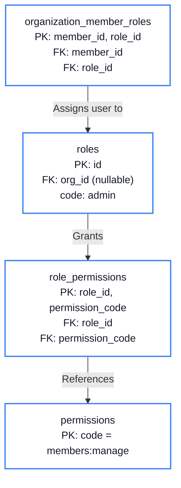
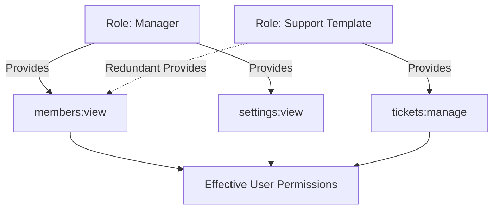

# Chapter 8: Permissions & Roles

<span class="chapter-label">Chapter 8 — Authorization Model</span>

<p class="chapter-intro">
Authentication answers the question "who are you?" Authorization answers "what are you allowed to
do?" This chapter explains how Rooiam implements a fine-grained, permission-based role system —
moving beyond simple admin/member binaries to a model that scales to enterprise requirements.
</p>

## 8.1 Two Layers of Authorization

Rooiam has two distinct privilege hierarchies:

**Platform Level** — applies across the entire Rooiam installation.
- `is_platform_owner`: one root user who controls the platform.
- `is_superuser`: platform staff who can administer workspaces.

**Workspace Level** — scoped to a specific organization.
- `Owner`, `Admin`, `Manager`, `Member`, `Viewer`: built-in roles.
- Custom roles: workspace owners can create roles with any combination of permissions.

Platform-level privileges are booleans on the `users` table. Workspace-level privileges are rows in the `roles` and `organization_members_roles` tables. This strict separation ensures a workspace administrator has no ability to affect the platform, and a platform administrator's workspace-level access is subject to the same membership rules as any other user.

## 8.2 The Permission Catalog

Rather than defining authorization logic in code as ad-hoc string comparisons, Rooiam maintains an explicit **permission catalog** in the `permissions` table:

```sql
CREATE TABLE permissions (
    code        VARCHAR(50)  PRIMARY KEY,   -- e.g., 'members:manage'
    name        VARCHAR(100) NOT NULL,
    description TEXT,
    created_at  TIMESTAMPTZ  NOT NULL DEFAULT NOW()
);
```

Permissions are identified by a `code` in `resource:action` format:

| Code | Name | Description |
|---|---|---|
| `members:view` | View Members | See the workspace member list |
| `members:manage` | Manage Members | Invite, remove, and change member roles |
| `roles:manage` | Manage Roles | Create and edit custom roles |
| `settings:view` | View Settings | Read workspace settings and policies |
| `settings:manage` | Manage Settings | Change auth policy, session limits, branding |
| `clients:manage` | Manage OAuth Clients | Create and configure OAuth applications |
| `api_keys:manage` | Manage API Keys | Create and revoke workspace API keys |
| `audit:view` | View Audit Logs | Read the workspace activity log |
| `billing:manage` | Manage Billing | Access billing and subscription settings |

This catalog is queryable (`GET /v1/orgs/current/roles/permissions`) and returned with descriptions — enabling UIs to render human-readable permission selection without hardcoding strings.

## 8.3 Roles and Role Assignment

A **role** is a named bundle of permissions. Rooiam ships with built-in roles and supports custom roles:

A **role** is a named bundle of permissions. Rooiam ships with built-in roles and supports custom roles. The relationships are modeled precisely to allow a member to hold multiple roles simultaneously:



```sql
CREATE TABLE roles (
    id              UUID        PRIMARY KEY DEFAULT gen_random_uuid(),
    organization_id UUID        REFERENCES organizations(id),  -- NULL = system role
    code            VARCHAR(50)  NOT NULL,
    name            VARCHAR(100) NOT NULL,
    is_system       BOOLEAN      NOT NULL DEFAULT false,
    created_at      TIMESTAMPTZ  NOT NULL DEFAULT NOW(),
    UNIQUE (organization_id, code)
);

CREATE TABLE role_permissions (
    role_id       UUID NOT NULL REFERENCES roles(id) ON DELETE CASCADE,
    permission_code VARCHAR(50) NOT NULL REFERENCES permissions(code),
    PRIMARY KEY (role_id, permission_code)
);

-- Bridge: which roles does a member hold in a workspace?
CREATE TABLE organization_member_roles (
    member_id UUID NOT NULL REFERENCES organization_members(id) ON DELETE CASCADE,
    role_id   UUID NOT NULL REFERENCES roles(id) ON DELETE CASCADE,
    PRIMARY KEY (member_id, role_id)
);
```

A user can hold **multiple roles** in a workspace simultaneously. Their effective permission set is the absolute union of all permissions from all their assigned roles.



## 8.4 System Roles

System roles (`is_system = true`) are created by the seed migration and cannot be deleted or renamed. Their permissions are fixed:

| Role | Key Permissions |
|---|---|
| `owner` | All permissions + transfer ownership |
| `admin` | `members:manage`, `settings:manage`, `clients:manage`, `audit:view`, + more |
| `manager` | `members:view`, `settings:view`, `audit:view` |
| `member` | `members:view` |
| `viewer` | Read-only access to basic workspace info |

The `owner` role has an additional protection: the **Last Owner Guard**. No operation — role change, member removal, workspace deletion — is allowed if it would leave a workspace with zero owners:

```rust
// Prevent removing the last owner — checked before any role change or removal
pub async fn check_last_owner_guard(
    pool: &PgPool,
    org_id: Uuid,
    user_ids_being_removed: &[Uuid],
) -> Result<(), AppError> {
    let owner_count: i64 = sqlx::query_scalar(
        "SELECT COUNT(DISTINCT om.user_id)
         FROM organization_members om
         JOIN organization_member_roles omr ON omr.member_id = om.id
         JOIN roles r ON r.id = omr.role_id
         WHERE om.organization_id = $1
           AND r.code = 'owner'
           AND r.is_system = true
           AND om.user_id <> ALL($2::uuid[])"
    )
    .bind(org_id)
    .bind(user_ids_being_removed)
    .fetch_one(pool).await?;

    if owner_count == 0 {
        return Err(AppError::Validation(
            "Cannot remove the last owner. Promote another member to Owner first.".into()
        ));
    }
    Ok(())
}
```

## 8.5 Permission Enforcement in Handlers

Every privileged API handler calls `ensure_org_permission` before doing any work:

```rust
async fn delete_member(
    req: HttpRequest,
    state: web::Data<AppState>,
    path: web::Path<Uuid>,
) -> Result<HttpResponse, AppError> {
    let session = extract_session(&req)?;
    let org_id  = session.current_org_id.ok_or(AppError::Unauthorized)?;

    // Must have members:manage permission in current workspace
    ensure_org_permission(&state.db, session.user_id, org_id, "members:manage").await?;

    let target_id = path.into_inner();
    // ... deletion logic
}
```

`ensure_org_permission` runs a single SQL query that:
1. Finds the member's active roles in the workspace.
2. Finds all permissions associated with those roles.
3. Checks if the required permission is in the result set.

```sql
SELECT 1
FROM organization_members om
JOIN organization_member_roles omr ON omr.member_id = om.id
JOIN role_permissions rp ON rp.role_id = omr.role_id
WHERE om.organization_id = $1
  AND om.user_id = $2
  AND rp.permission_code = $3
  AND om.status = 'active'
LIMIT 1;
```

If the query returns no rows, the user lacks the permission and the handler returns `403 Forbidden` immediately.

## 8.6 Role Diff View

Workspace owners can compare two roles side by side to understand how they differ. The `GET /v1/orgs/current/role-diff?role_a=&role_b=` endpoint returns:

```json
{
  "role_a_id": "uuid-of-admin",
  "role_b_id": "uuid-of-manager",
  "only_in_a": ["members:manage", "settings:manage", "clients:manage"],
  "only_in_b": [],
  "in_both": ["members:view", "settings:view", "audit:view"]
}
```

This makes it easy to decide whether to promote a user to a higher role or create a custom role with a specific subset of permissions.

## 8.7 Built-In Role Templates

To accelerate custom role creation, Rooiam provides built-in **role templates** — predefined permission sets for common enterprise use cases:

| Template | Purpose | Key Permissions |
|---|---|---|
| Billing Admin | Finance team member | `billing:manage`, `settings:view` |
| Support Agent | Customer support | `members:view`, `audit:view` |
| Auditor | Compliance review | `audit:view`, `settings:view` |
| Security Admin | InfoSec team | `settings:manage`, `audit:view`, `members:view` |

These are returned by `GET /v1/orgs/current/role-templates` and can be instantiated as custom roles with one API call.

---

<div class="summary-box">
<div class="summary-box-title">Chapter Summary</div>

- Rooiam uses a **two-layer privilege model**: platform-level (booleans on `users`) and workspace-level (role tables).
- **Permissions** are atomic capabilities identified by `resource:action` codes, stored in a queryable catalog.
- **Roles** bundle permissions. Users hold multiple roles; their effective permissions are the union of all role permissions.
- The **Last Owner Guard** prevents any operation that would leave a workspace with zero owners.
- Every privileged handler calls `ensure_org_permission` — permissions are checked as close to the data as possible, not at the routing layer.
- **Role diff** and **role templates** give workspace owners tools to understand and manage the permission model efficiently.

</div>

---

<div class="exercises">
<div class="exercises-title">Exercises</div>

1. A user holds both `manager` and a custom "Support" role. The manager role has `members:view`. The Support role does not have `members:view`. Can the user see the member list? Explain why the union of permissions is generally the correct model, and describe a scenario where it might be undesirable.

2. The `ensure_org_permission` query uses `LIMIT 1`. Why? What is the performance implication of using `SELECT 1` instead of `SELECT COUNT(*)`?

3. The Last Owner Guard prevents removing the last owner *by role change*. What other operations need this same check? (Hint: think about deleting a user's account, suspending a user, or a user leaving a workspace voluntarily.)

4. Custom roles are stored with `organization_id` set. System roles have `organization_id = NULL`. A query `SELECT * FROM roles WHERE organization_id = $1 OR organization_id IS NULL` returns both. Why is this the right query for "all roles this workspace can use"?

</div>
