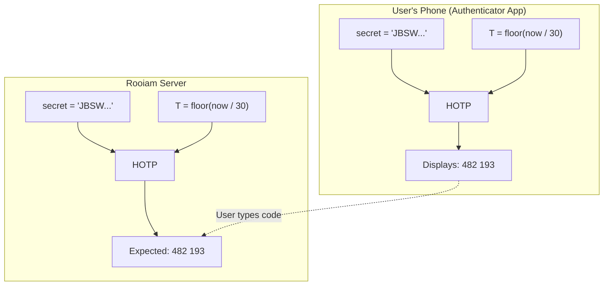
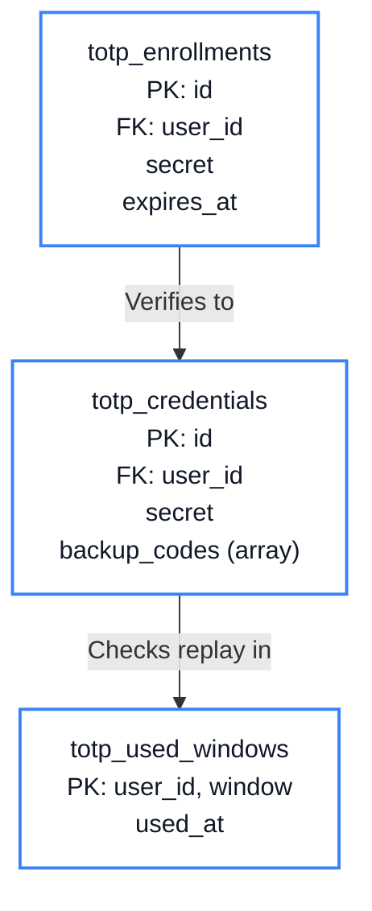
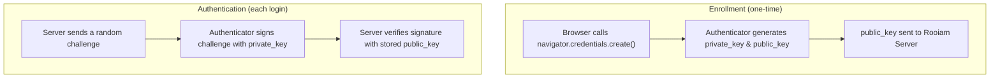
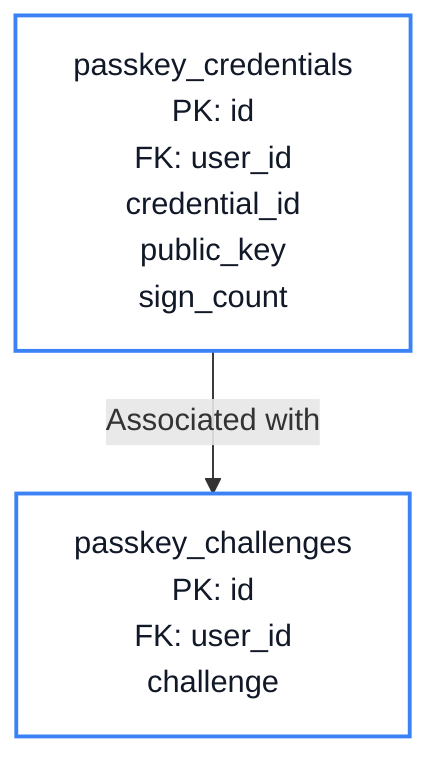
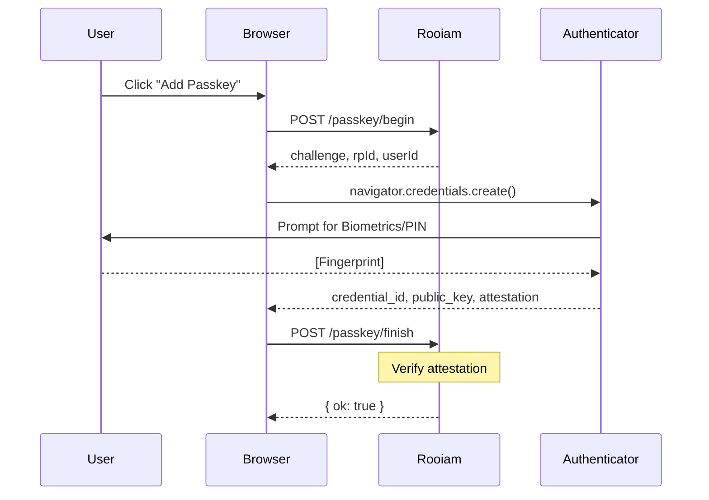
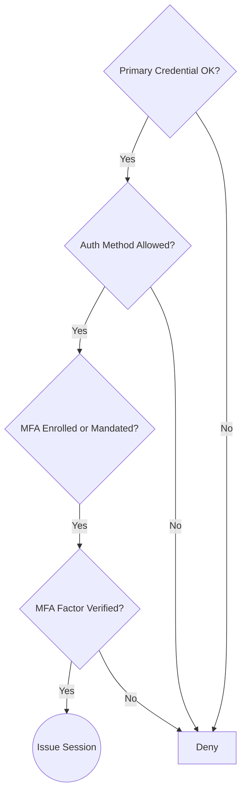

# Chapter 9: MFA & Passkeys

<span class="chapter-label">Chapter 9 — Authentication Hardening</span>

<p class="chapter-intro">
A password — or even a magic link — is a single point of failure. This chapter layers two
additional proofs of identity onto every login: a time-based one-time code (TOTP) and a
hardware-bound cryptographic passkey. Together they transform authentication from a single
secret into a multi-factor ceremony that attackers cannot easily replicate.
</p>

## 9.1 The Single-Factor Problem

Every authentication scheme covered so far relies on one shared secret:

| Chapter | Secret |
|---|---|
| Magic Link | One-time token emailed to the user |
| Social Login | Access token from the OAuth provider |
| Password (classic) | A string the user memorises |

A single secret has a single failure mode. If that secret is:

- **Phished** — the user types it into a fake login page.
- **Leaked** — a data breach exposes a hashed password that is then cracked offline.
- **Intercepted** — a man-in-the-middle captures the magic link before the user clicks it.

…then the attacker gains full access to the account.

The solution is **Multi-Factor Authentication (MFA)**: require the user to prove identity
using two or more independent factors from different *categories*:

| Category | Example | What an attacker needs |
|---|---|---|
| Something you **know** | Password, magic link | Steal the secret |
| Something you **have** | TOTP app, hardware key | Steal the physical device |
| Something you **are** | Fingerprint, face | Biometrics (very hard to steal) |

Rooiam implements two MFA factors: **TOTP** (something you have — a phone app) and
**WebAuthn passkeys** (something you have — a hardware key or biometric authenticator).

## 9.2 TOTP: Time-Based One-Time Passwords

### The Algorithm

TOTP is defined in RFC 6238. The math is elegant:

```
TOTP(key, time) = HOTP(key, T)
     where T = floor(unix_timestamp / 30)
```

`T` is the current 30-second time window. Every 30 seconds, `T` increments by 1. The
`HOTP` function (RFC 4226) computes an HMAC-SHA1 of the shared secret `key` and the
counter `T`, then extracts 6 decimal digits from the result.

The crucial insight: **both sides know the shared secret and both know the current time**.
Neither needs to send the other a token — they each independently compute the same 6-digit
code. The attacker cannot reverse the HMAC to recover the secret from intercepted codes.


<p class="diagram-caption">Figure 9.1 — TOTP requires no network call. Both sides derive the same code from a shared secret and the current time window.</p>

### TOTP Enrollment Schema

This diagram separates the temporary enrollment record from the long-lived TOTP credential and the replay-protection table.



```sql
-- Pending enrollments (not yet verified by the user)
CREATE TABLE totp_enrollments (
    id          UUID        PRIMARY KEY DEFAULT gen_random_uuid(),
    user_id     UUID        NOT NULL REFERENCES users(id) ON DELETE CASCADE,
    secret      TEXT        NOT NULL,   -- base32-encoded TOTP secret (sensitive!)
    created_at  TIMESTAMPTZ NOT NULL DEFAULT NOW(),
    expires_at  TIMESTAMPTZ NOT NULL DEFAULT (NOW() + INTERVAL '10 minutes')
);

-- Confirmed, active TOTP credentials
CREATE TABLE totp_credentials (
    id              UUID        PRIMARY KEY DEFAULT gen_random_uuid(),
    user_id         UUID        NOT NULL REFERENCES users(id) ON DELETE CASCADE,
    secret          TEXT        NOT NULL,   -- base32 secret
    backup_codes    TEXT[]      NOT NULL DEFAULT '{}', -- SHA-256 hashed
    last_used_at    TIMESTAMPTZ,
    created_at      TIMESTAMPTZ NOT NULL DEFAULT NOW()
);

-- Prevent replay: each (user, code, window) can only succeed once
CREATE TABLE totp_used_windows (
    user_id     UUID        NOT NULL,
    window      BIGINT      NOT NULL,   -- T value
    used_at     TIMESTAMPTZ NOT NULL DEFAULT NOW(),
    PRIMARY KEY (user_id, window)
);
```

**Why two tables?** The enrollment table holds an *unverified* secret. The user must
successfully enter a valid code before we promote the secret to `totp_credentials`. This
prevents a scenario where an attacker who intercepts the setup QR code permanently locks
the legitimate user out by claiming enrollment first.

**`totp_used_windows`** is the replay-prevention mechanism. Because TOTP codes are valid
for 30 seconds, an attacker who captures a code over the shoulder has a brief window to
reuse it. Storing the `(user_id, T)` pair after a successful login and rejecting any
subsequent use of the same window closes this attack.

### The MFA Gate

After the primary credential check succeeds (magic link, social login, etc.), Rooiam's
login flow does not immediately create a session. Instead, it checks whether the user
has MFA enrolled:

```rust
// src/modules/auth/mfa_gate.rs

pub async fn check_mfa_required(
    db:      &PgPool,
    user_id: Uuid,
) -> Result<MfaGateResult, AppError> {
    // Does the user have any active MFA credential?
    let has_totp = sqlx::query_scalar!(
        "SELECT EXISTS(SELECT 1 FROM totp_credentials WHERE user_id = $1)",
        user_id
    )
    .fetch_one(db)
    .await?
    .unwrap_or(false);

    let has_passkey = sqlx::query_scalar!(
        "SELECT EXISTS(SELECT 1 FROM passkey_credentials WHERE user_id = $1)",
        user_id
    )
    .fetch_one(db)
    .await?
    .unwrap_or(false);

    if has_totp || has_passkey {
        // Issue a short-lived MFA challenge token, NOT a full session
        let challenge_token = generate_challenge_token(db, user_id).await?;
        return Ok(MfaGateResult::ChallengeRequired(challenge_token));
    }

    Ok(MfaGateResult::NotRequired)
}
```

The `ChallengeRequired` result issues an **MFA challenge token** — a short-lived,
single-use token stored in Redis. The client redirects to the MFA screen. Only after
the user enters a valid TOTP code (or passes a passkey assertion) does the server
exchange the challenge token for a real session cookie.

> **Security Principle**: Never issue a session before all required factors are verified.
> An attacker who intercepts the post-password-check state but before MFA completion
> must not be able to use that partial state.

### TOTP Verification

```rust
// src/modules/auth/totp_verify.rs

pub async fn verify_totp(
    db:        &PgPool,
    user_id:   Uuid,
    user_code: &str,
) -> Result<(), AppError> {
    let credential = sqlx::query!(
        "SELECT secret FROM totp_credentials WHERE user_id = $1",
        user_id
    )
    .fetch_optional(db)
    .await?
    .ok_or(AppError::NotFound("no TOTP credential"))?;

    let now_secs = SystemTime::now()
        .duration_since(UNIX_EPOCH)?
        .as_secs();

    // Check current window and one window on each side (clock drift tolerance)
    for delta in [-1i64, 0, 1] {
        let t = (now_secs as i64 / 30) + delta;

        // Reject already-used windows
        let already_used = sqlx::query_scalar!(
            "SELECT EXISTS(SELECT 1 FROM totp_used_windows
             WHERE user_id = $1 AND window = $2)",
            user_id, t
        )
        .fetch_one(db)
        .await?
        .unwrap_or(false);

        if already_used {
            continue;
        }

        let expected = compute_totp(&credential.secret, t as u64)?;
        if expected == user_code {
            // Mark this window as used (replay prevention)
            sqlx::query!(
                "INSERT INTO totp_used_windows (user_id, window)
                 VALUES ($1, $2) ON CONFLICT DO NOTHING",
                user_id, t
            )
            .execute(db)
            .await?;

            return Ok(());
        }
    }

    Err(AppError::InvalidCredentials)
}
```

The `delta` loop handles **clock drift** — a phone that is 25 seconds behind the server
would be in time window `T-1`. Accepting one window on either side of the current window
tolerates up to ~59 seconds of drift, which covers all real-world scenarios.

### Backup Codes

If a user loses their phone, TOTP becomes a lockout mechanism. Rooiam generates **10
single-use backup codes** during TOTP enrollment:

```rust
pub fn generate_backup_codes() -> (Vec<String>, Vec<String>) {
    let mut codes: Vec<String> = Vec::with_capacity(10);
    let mut hashes: Vec<String> = Vec::with_capacity(10);

    for _ in 0..10 {
        // Human-readable format: XXXX-XXXX-XXXX
        let raw = format!(
            "{:04X}-{:04X}-{:04X}",
            OsRng.next_u32() & 0xFFFF,
            OsRng.next_u32() & 0xFFFF,
            OsRng.next_u32() & 0xFFFF,
        );
        let hash = hex::encode(Sha256::digest(raw.as_bytes()));
        codes.push(raw);
        hashes.push(hash);
    }

    (codes, hashes)  // codes shown to user once; hashes stored in DB
}
```

The raw codes are shown to the user **once** and never stored. Only their SHA-256 hashes
live in `totp_credentials.backup_codes`. When a backup code is used, the server hashes
the user's input and removes the matching hash from the array — it can never be used again.

## 9.3 WebAuthn Passkeys

### Why TOTP Is Not Enough

TOTP codes are phishable. A sophisticated attacker can build a real-time proxy that:
1. Shows the user a fake login page.
2. Relays the credentials (including the TOTP code) to the real site immediately.
3. Logs in before the 30-second window expires.

WebAuthn solves this with **origin binding**: the passkey cryptographically includes the
domain name in every authentication response. A page running on `evil.com` physically
cannot produce a valid assertion for `app.rooiam.com`, even if the user was tricked into
interacting with the fake page.

### How WebAuthn Works

WebAuthn uses **public-key cryptography** instead of shared secrets:



The `sign_count` is a counter that the authenticator increments on every use. The server
stores the last known value. If an attacker clones the authenticator and uses it, the
real device's counter will fall behind — Rooiam detects the anomaly and blocks login.

### Passkey Schema

This schema shows the durable passkey credential alongside the short-lived challenge rows used during registration and sign-in.



```sql
CREATE TABLE passkey_credentials (
    id              UUID        PRIMARY KEY DEFAULT gen_random_uuid(),
    user_id         UUID        NOT NULL REFERENCES users(id) ON DELETE CASCADE,
    credential_id   BYTEA       UNIQUE NOT NULL, -- WebAuthn credential handle
    public_key      BYTEA       NOT NULL,         -- COSE-encoded public key
    sign_count      BIGINT      NOT NULL DEFAULT 0,
    aaguid          UUID,                         -- Authenticator model identifier
    device_name     VARCHAR(200),                 -- User-provided label ("YubiKey 5")
    last_used_at    TIMESTAMPTZ,
    created_at      TIMESTAMPTZ NOT NULL DEFAULT NOW()
);

-- Pre-registration challenges (short-lived; production uses Redis)
CREATE TABLE passkey_challenges (
    id          UUID        PRIMARY KEY DEFAULT gen_random_uuid(),
    user_id     UUID        NOT NULL REFERENCES users(id) ON DELETE CASCADE,
    challenge   BYTEA       NOT NULL,   -- 32 random bytes
    created_at  TIMESTAMPTZ NOT NULL DEFAULT NOW(),
    expires_at  TIMESTAMPTZ NOT NULL DEFAULT (NOW() + INTERVAL '5 minutes')
);
```

### WebAuthn Registration Flow


<p class="diagram-caption">Figure 9.2 — The passkey registration ceremony. The private key never leaves the authenticator hardware.</p>

### WebAuthn Assertion Verification

```rust
// src/modules/auth/passkey_verify.rs (abridged)

pub async fn verify_passkey_assertion(
    db:        &PgPool,
    user_id:   Uuid,
    assertion: &PasskeyAssertionResponse,
) -> Result<(), AppError> {
    // 1. Load stored credential by credential_id
    let cred = sqlx::query!(
        "SELECT public_key, sign_count FROM passkey_credentials
         WHERE credential_id = $1 AND user_id = $2",
        assertion.credential_id.as_slice(),
        user_id
    )
    .fetch_optional(db)
    .await?
    .ok_or(AppError::NotFound("unknown credential"))?;

    // 2. Verify cryptographic signature (uses webauthn-rs crate)
    //    This also verifies:
    //    - rpIdHash == SHA-256("app.rooiam.com")  ← origin binding
    //    - challenge matches the issued challenge
    //    - signature is valid for the stored public key
    let verified = webauthn.verify_authentication_response(
        &assertion.response,
        &cred.public_key,
        &expected_challenge,
    )?;

    // 3. Clone detection via sign_count
    let new_count = verified.sign_count as i64;
    if new_count <= cred.sign_count && new_count != 0 {
        // Authenticator counter went backwards — possible cloning attack
        return Err(AppError::SecurityViolation("sign_count regression"));
    }

    // 4. Persist updated sign_count
    sqlx::query!(
        "UPDATE passkey_credentials
         SET sign_count = $1, last_used_at = NOW()
         WHERE credential_id = $2",
        new_count,
        assertion.credential_id.as_slice()
    )
    .execute(db)
    .await?;

    Ok(())
}
```

The `rpIdHash` check inside `verify_authentication_response` is what makes passkeys
phishing-resistant. The authenticator embeds `SHA-256(relying_party_id)` in every
assertion. An assertion produced on `evil.com` would contain `SHA-256("evil.com")` —
the library rejects it because it does not match `SHA-256("app.rooiam.com")`.

## 9.4 MFA Policy at the Organisation Level

Individual users can opt in to MFA, but enterprise organisations need to **mandate** it.
The `organizations` table (Chapter 5) includes:

```sql
require_mfa  BOOLEAN NOT NULL DEFAULT false
```

When `require_mfa = true`, the login flow checks for an enrolled MFA credential. If none
exists, the user is redirected to the MFA enrollment page before reaching the
application — they cannot proceed with a credential-only session.

```rust
// After primary login, before session issuance:
if org.require_mfa && !user_has_mfa(db, user_id).await? {
    return Err(AppError::MfaEnrollmentRequired);
}
```

This check is enforced in the auth policy engine alongside the `allowed_auth_methods`
check from Chapter 5. Together they form a layered policy gate:



---

<div class="summary-box">
<div class="summary-box-title">Chapter Summary</div>

- **TOTP** (RFC 6238) derives 6-digit codes from a shared secret and the current 30-second
  time window — no network call needed. Both sides independently compute the same code.
- **Replay prevention** requires storing used `(user_id, T)` pairs; without this, a
  code intercepted within the 30-second window can be reused.
- **Backup codes** are generated at enrollment, shown once, and stored only as SHA-256
  hashes — each is single-use and removes itself from the array on consumption.
- **WebAuthn passkeys** use public-key cryptography and **origin binding** — the
  authenticator embeds the domain name in every signed assertion, making passkeys
  fundamentally phishing-resistant unlike TOTP.
- The **`sign_count`** anti-cloning mechanism detects copied authenticators by
  rejecting responses where the counter has not advanced past the stored value.
- **Organisation-level `require_mfa`** mandates MFA enrollment before the user reaches
  the application, enforced as a gate in the auth policy engine.

</div>

---

<div class="exercises">
<div class="exercises-title">Exercises</div>

1. A user's TOTP code is `482193`. An attacker intercepts it and immediately tries to log
   in with the same code. Trace the path through `verify_totp`. Which table and query
   reject the attempt?

2. The `delta` loop in TOTP verification accepts windows `-1, 0, +1`. What is the maximum
   clock drift (in seconds) this tolerates? What happens if a phone is exactly 45 seconds
   behind the server?

3. A security researcher reports: "Your TOTP backup codes are only 48 bits of entropy
   (3 × 16-bit hex segments)." Is this a real vulnerability? How many codes are issued,
   and how does the server prevent online brute-force?

4. A user registers a passkey on `https://app.rooiam.com`. A phishing page at
   `https://app-rooiam.com` asks their browser to produce a passkey assertion. Step
   through the WebAuthn assertion verification code. At which exact check does the
   attack fail?

</div>
