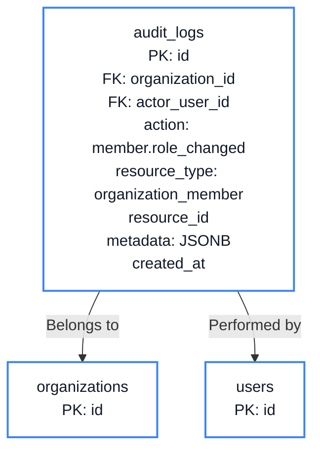
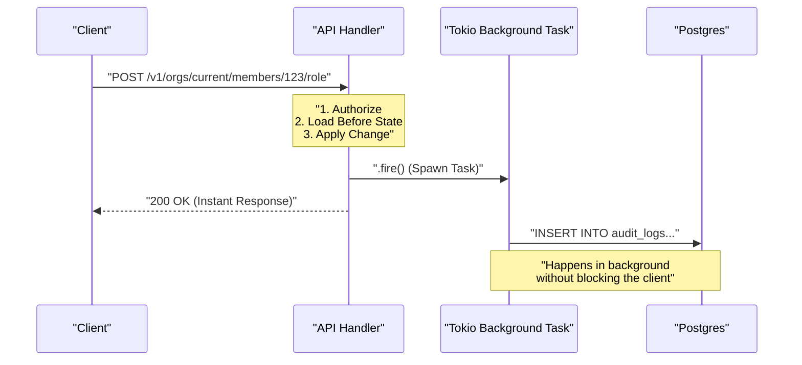

# Chapter 10: Audit Logs

<span class="chapter-label">Chapter 10 — Accountability</span>

<p class="chapter-intro">
Security controls prevent bad outcomes. Audit logs prove what actually happened.
Enterprise organisations — and every compliance framework from SOC 2 to ISO 27001 — require
an immutable record of who did what to which resource and when. This chapter builds that
record correctly: append-only, tamper-evident, and queryable without impacting normal
request latency.
</p>

## 10.1 Why Audit Logs Are Not Optional

Consider three scenarios that Rooiam must support:

**Scenario A — Security Incident Response**: An administrator notices that 50 users were
removed from an organisation at 03:14 on a Sunday. Who ran the command? From what IP?
Was the actor's session still valid at the time?

**Scenario B — Compliance Audit**: A SOC 2 auditor asks for a 90-day record of every
change to user permissions within a tenant. The record must be exportable and must include
the before and after state.

**Scenario C — Insider Threat Investigation**: An employee claims they never changed an
API key. The organisation's security team needs a cryptographically trustworthy record
showing that the change did happen, from the employee's session, at a specific time.

In all three cases, the same requirements emerge:

1. **Immutable** — log entries can never be modified or deleted after the fact.
2. **Comprehensive** — every write operation on sensitive resources must be captured.
3. **Structured** — logs must be machine-queryable (filter by actor, resource, action, date).
4. **Low-latency** — logging must not block the primary operation.

## 10.2 The Append-Only Design

The fundamental property of an audit log is immutability. In a relational database, this
means: **no `UPDATE` or `DELETE` is ever run against the audit table**. The application
enforces this at the code level; the database enforces it with a trigger:

```sql
-- Prevent any modification or deletion of audit log entries
CREATE OR REPLACE FUNCTION audit_log_immutable()
RETURNS TRIGGER AS $$
BEGIN
    RAISE EXCEPTION 'audit_logs is append-only: UPDATE and DELETE are not permitted';
END;
$$ LANGUAGE plpgsql;

CREATE TRIGGER enforce_audit_immutability
    BEFORE UPDATE OR DELETE ON audit_logs
    FOR EACH ROW EXECUTE FUNCTION audit_log_immutable();
```

This trigger makes immutability a **database-level guarantee**, not just a convention.
Even if application code has a bug that issues an `UPDATE`, the database rejects it with
an exception. The same pattern from Chapter 1 applies here: enforce business rules in
the database where application bugs cannot reach them.

## 10.3 The Schema

This schema highlights the minimum audit record: who acted, which organization the event belongs to, what happened, and when it happened.



```sql
CREATE TABLE audit_logs (
    id              UUID        PRIMARY KEY DEFAULT gen_random_uuid(),

    -- Tenant scoping: every audit log belongs to exactly one organisation
    organization_id UUID        REFERENCES organizations(id) ON DELETE SET NULL,

    -- The actor: who performed the action
    actor_user_id   UUID        REFERENCES users(id) ON DELETE SET NULL,
    actor_session_id UUID       REFERENCES sessions(id) ON DELETE SET NULL,
    actor_ip        INET,                        -- IPv4 or IPv6 address
    actor_user_agent TEXT,

    -- The action: what was done
    action          VARCHAR(100) NOT NULL,        -- e.g. "member.role_changed"
    resource_type   VARCHAR(100),                 -- e.g. "organization_member"
    resource_id     UUID,                         -- the affected row's PK

    -- The payload: before and after state
    metadata        JSONB        NOT NULL DEFAULT '{}',

    -- Timestamp: always UTC, never updatable
    created_at      TIMESTAMPTZ  NOT NULL DEFAULT NOW()
);

-- Query indexes
CREATE INDEX idx_audit_logs_org_created
    ON audit_logs (organization_id, created_at DESC);

CREATE INDEX idx_audit_logs_actor
    ON audit_logs (actor_user_id, created_at DESC);

CREATE INDEX idx_audit_logs_resource
    ON audit_logs (resource_type, resource_id);

CREATE INDEX idx_audit_logs_action
    ON audit_logs (action);
```

Several design choices require explanation:

**`ON DELETE SET NULL` on foreign keys** — If a user is deleted, we do NOT want their
audit log entries to disappear (that would defeat the purpose of an audit log). Setting
the FK to `NULL` preserves the log entry while acknowledging the user no longer exists.
The `metadata` column retains the actor's name and email at the time of the action.

**`JSONB metadata`** — Different actions carry different data. A `member.role_changed`
event needs `{ before: "viewer", after: "admin" }`. A `session.login` event needs
`{ mfa_used: true, auth_method: "magic_link" }`. JSONB lets each event type carry
exactly what it needs without requiring schema changes for new event types.

**Composite index on `(organization_id, created_at DESC)`** — The most common query
pattern is "show me the last 100 events for organisation X". This index serves that
query directly without a full table scan.

## 10.4 The Rust Data Model

```rust
// src/modules/audit/models.rs

use serde::{Deserialize, Serialize};
use serde_json::Value;
use uuid::Uuid;
use chrono::{DateTime, Utc};

#[derive(Debug, Clone, sqlx::FromRow, Serialize)]
pub struct AuditLog {
    pub id:               Uuid,
    pub organization_id:  Option<Uuid>,
    pub actor_user_id:    Option<Uuid>,
    pub actor_session_id: Option<Uuid>,
    pub actor_ip:         Option<String>,
    pub actor_user_agent: Option<String>,
    pub action:           String,
    pub resource_type:    Option<String>,
    pub resource_id:      Option<Uuid>,
    pub metadata:         Value,           // serde_json::Value maps to JSONB
    pub created_at:       DateTime<Utc>,
}

/// Builder for creating audit log entries.
/// All fields are optional except `action` — call `.write(db).await` to persist.
pub struct AuditEvent {
    pub organization_id:  Option<Uuid>,
    pub actor_user_id:    Option<Uuid>,
    pub actor_session_id: Option<Uuid>,
    pub actor_ip:         Option<String>,
    pub actor_user_agent: Option<String>,
    pub action:           String,
    pub resource_type:    Option<String>,
    pub resource_id:      Option<Uuid>,
    pub metadata:         Value,
}

impl AuditEvent {
    pub fn new(action: impl Into<String>) -> Self {
        AuditEvent {
            organization_id:  None,
            actor_user_id:    None,
            actor_session_id: None,
            actor_ip:         None,
            actor_user_agent: None,
            action:           action.into(),
            resource_type:    None,
            resource_id:      None,
            metadata:         serde_json::json!({}),
        }
    }

    pub fn org(mut self, id: Uuid) -> Self {
        self.organization_id = Some(id);
        self
    }

    pub fn actor(mut self, user_id: Uuid, session_id: Uuid) -> Self {
        self.actor_user_id    = Some(user_id);
        self.actor_session_id = Some(session_id);
        self
    }

    pub fn resource(mut self, rtype: &str, rid: Uuid) -> Self {
        self.resource_type = Some(rtype.to_string());
        self.resource_id   = Some(rid);
        self
    }

    pub fn meta(mut self, data: serde_json::Value) -> Self {
        self.metadata = data;
        self
    }

    /// Write to the database. Fire-and-forget: spawns a Tokio task so
    /// the calling request handler is not blocked by the insert.
    pub fn fire(self, db: PgPool) {
        tokio::spawn(async move {
            if let Err(e) = self.write(&db).await {
                tracing::error!("audit log write failed: {e}");
            }
        });
    }

    async fn write(self, db: &PgPool) -> Result<(), sqlx::Error> {
        sqlx::query!(
            r#"
            INSERT INTO audit_logs
                (organization_id, actor_user_id, actor_session_id,
                 actor_ip, actor_user_agent,
                 action, resource_type, resource_id, metadata)
            VALUES ($1,$2,$3,$4,$5,$6,$7,$8,$9)
            "#,
            self.organization_id,
            self.actor_user_id,
            self.actor_session_id,
            self.actor_ip,
            self.actor_user_agent,
            self.action,
            self.resource_type,
            self.resource_id,
            self.metadata,
        )
        .execute(db)
        .await?;
        Ok(())
    }
}
```

The `.fire()` method is important. It spawns a Tokio background task and returns
immediately. The calling handler does not `await` the audit write — if the log insert
takes 50 ms due to disk pressure, the user's response is already on its way. Audit
logging must never add latency to the primary operation.



## 10.5 Instrumenting Handlers

Call sites look like this:

```rust
// src/modules/organization/handlers.rs

pub async fn change_member_role(
    state:    web::Data<AppState>,
    auth:     AuthenticatedUser,     // session + user from middleware
    path:     web::Path<(Uuid, Uuid)>,
    body:     web::Json<ChangeRoleRequest>,
) -> Result<HttpResponse, AppError> {
    let (org_id, member_id) = path.into_inner();

    // 1. Permission check: actor must be org admin
    ensure_org_permission(&state.db, auth.user.id, org_id, "members:write").await?;

    // 2. Load current role (needed for audit "before" value)
    let before_role = get_member_role(&state.db, org_id, member_id).await?;

    // 3. Apply the change
    set_member_role(&state.db, org_id, member_id, &body.role).await?;

    // 4. Write audit log — fire-and-forget, does not block response
    AuditEvent::new("member.role_changed")
        .org(org_id)
        .actor(auth.user.id, auth.session.id)
        .resource("organization_member", member_id)
        .meta(serde_json::json!({
            "before": before_role,
            "after":  body.role,
            "target_user_id": member_id,
        }))
        .fire(state.db.clone());

    Ok(HttpResponse::Ok().json(serde_json::json!({ "ok": true })))
}
```

The pattern is always the same:
1. Authorise.
2. Capture the before-state (if relevant).
3. Apply the change.
4. Fire the audit event.

## 10.6 Standard Action Taxonomy

A consistent naming scheme makes audit logs queryable across teams. Rooiam uses
`resource.action` format:

| Action | Trigger |
|---|---|
| `session.login` | Successful login (any method) |
| `session.logout` | Explicit logout |
| `session.expired` | Session expired or revoked |
| `member.invited` | Invitation sent |
| `member.joined` | User accepted invitation |
| `member.removed` | Member removed from org |
| `member.role_changed` | Role assignment changed |
| `org.settings_changed` | Organisation settings updated |
| `org.mfa_policy_changed` | MFA requirement toggled |
| `api_key.created` | New API key issued |
| `api_key.revoked` | API key revoked |
| `oidc_client.created` | OIDC client application registered |
| `oidc_client.secret_rotated` | Client secret regenerated |
| `passkey.registered` | New passkey enrolled |
| `passkey.removed` | Passkey deleted |

This taxonomy ensures that a dashboard query like `WHERE action LIKE 'member.%'` returns
every membership-related event across the organisation's history.

## 10.7 Querying the Audit Log

The API endpoint for fetching logs applies tenant scoping and cursor-based pagination:

```rust
// src/modules/audit/handlers.rs

pub async fn list_audit_logs(
    state:  web::Data<AppState>,
    auth:   AuthenticatedUser,
    path:   web::Path<Uuid>,          // org_id
    query:  web::Query<AuditQuery>,
) -> Result<HttpResponse, AppError> {
    let org_id = path.into_inner();

    // Only org admins can view audit logs
    ensure_org_permission(&state.db, auth.user.id, org_id, "audit:read").await?;

    let logs = sqlx::query_as!(
        AuditLog,
        r#"
        SELECT * FROM audit_logs
        WHERE organization_id = $1
          AND ($2::TEXT IS NULL OR action = $2)
          AND ($3::UUID IS NULL OR actor_user_id = $3)
          AND created_at < COALESCE($4, NOW())
        ORDER BY created_at DESC
        LIMIT 50
        "#,
        org_id,
        query.action,
        query.actor_id,
        query.before,
    )
    .fetch_all(&state.db)
    .await?;

    Ok(HttpResponse::Ok().json(logs))
}
```

The `created_at < COALESCE($4, NOW())` clause implements **cursor-based pagination**.
Instead of `OFFSET` (which scans all prior rows), the client passes the `created_at`
of the last record it received. The next page starts from that timestamp. This pattern
remains fast even when the audit table has millions of rows.

> **Important**: The `WHERE organization_id = $1` clause is not optional. Without it,
> an admin of one organisation could read another organisation's audit logs — an IDOR
> vulnerability identical to the one described in Chapter 5.

---

<div class="summary-box">
<div class="summary-box-title">Chapter Summary</div>

- Audit logs are **append-only** by design; a database trigger prevents `UPDATE` or
  `DELETE` even if application code contains a bug.
- **`ON DELETE SET NULL`** on actor foreign keys preserves log entries when users are
  deleted — losing the audit record when an account is deleted would defeat its purpose.
- **JSONB metadata** allows each event type to carry structured before/after state without
  schema migrations for new event types.
- The **`.fire()` pattern** spawns a background Tokio task for the log insert so audit
  logging never adds latency to the primary operation.
- **Cursor-based pagination** (`created_at <`) on large audit tables avoids the
  performance cliff of `OFFSET` pagination.
- Every query against `audit_logs` must include `organization_id` to prevent IDOR
  access to another tenant's records.

</div>

---

<div class="exercises">
<div class="exercises-title">Exercises</div>

1. The `actor_user_id` column uses `ON DELETE SET NULL`. A compliance auditor asks:
   "If a malicious insider deletes their own account, does that erase their audit trail?"
   Trace what happens to their `audit_logs` rows when their `users` row is deleted. Does
   the audit trail survive?

2. The `.fire()` method uses `tokio::spawn` rather than `.await`. What happens if the
   database connection pool is exhausted at the moment of the spawn? Is the audit entry
   guaranteed to be written? What trade-offs does this design accept?

3. A new feature adds a `bulk_remove_members` endpoint that removes up to 100 members
   in a single HTTP request. Should this emit one audit log entry or 100? Argue both
   sides, then decide.

4. Write a SQL query that returns the 10 most active actors (by number of actions) in
   organisation `'a0eebc99-9c0b-4ef8-bb6d-6bb9bd380a11'` over the past 30 days, along
   with a count of each action type they performed.

</div>
