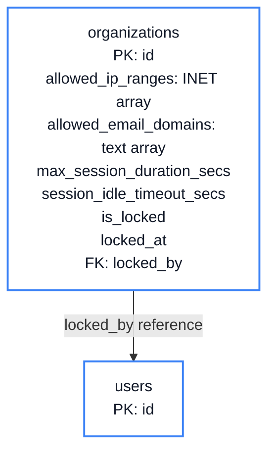
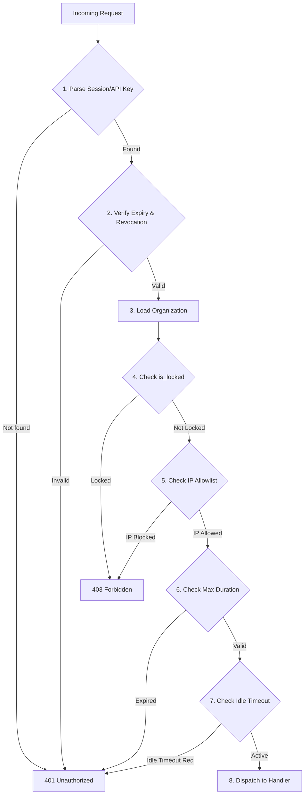

# Chapter 12: Corporate Guardrails

<span class="chapter-label">Chapter 12 — Enterprise Policy Enforcement</span>

<p class="chapter-intro">
The previous eleven chapters built a complete IAM system. This final chapter asks: what
does a paying enterprise customer need that a startup does not? The answer is
<em>policy enforcement at the infrastructure layer</em> — IP allowlists, session time
limits, idle timeouts, domain restrictions, and emergency lockdown — capabilities that
transform Rooiam from a login service into an enterprise compliance tool.
</p>

## 12.1 The Enterprise Requirements Gap

A startup deploying Rooiam needs authentication to work. A hospital, a bank, or a
defence contractor needs additional guarantees:

| Requirement | Business Driver |
|---|---|
| **IP Allowlist** | Only company VPN or office network can log in |
| **Domain Restriction** | Only `@hospital.org` email addresses can join |
| **Session Time Limit** | Compliance mandates sessions expire after 8 hours |
| **Idle Timeout** | A workstation left unattended must re-authenticate after 15 minutes |
| **Emergency Lockdown** | All sessions for an org can be terminated in one action |
| **Audit Retention** | Logs must be kept for 7 years (HIPAA requirement) |

These are not features that can be added by application developers customising the app.
They must be enforced by the IAM layer itself, before any application code runs, on
every single request.

## 12.2 The Policy Columns

All corporate guardrail settings live in the `organizations` table alongside the
auth policy columns from Chapter 5:



```sql
ALTER TABLE organizations ADD COLUMN
    -- IP network policy
    allowed_ip_ranges     INET[]      NOT NULL DEFAULT '{}',
    -- e.g. {"192.168.1.0/24", "10.0.0.0/8", "203.0.113.42/32"}

    -- Domain restriction
    allowed_email_domains TEXT[]      NOT NULL DEFAULT '{}',
    -- e.g. {"hospital.org", "hospital.net"}
    -- Empty array = no restriction (any domain allowed)

    -- Session lifetime policy (seconds; 0 = platform default)
    max_session_duration_secs  INTEGER NOT NULL DEFAULT 0,
    -- e.g. 28800 = 8 hours

    -- Idle timeout policy (seconds; 0 = no idle timeout)
    session_idle_timeout_secs  INTEGER NOT NULL DEFAULT 0,
    -- e.g. 900 = 15 minutes

    -- Emergency lockdown
    is_locked           BOOLEAN     NOT NULL DEFAULT false,
    locked_at           TIMESTAMPTZ,
    locked_by           UUID        REFERENCES users(id) ON DELETE SET NULL,
    lock_reason         TEXT;
```

These columns are checked at two points:
1. **At login** — IP check, domain check, lockdown check.
2. **On every request** — session duration and idle timeout checks.

## 12.3 IP Allowlists

### The Problem

A hospital's payroll administrator can log in from their office computer, their home
laptop, and a cafe in Bangkok. The hospital's security policy says: only log in from
within the hospital network or via the hospital's VPN. Any login from an unrecognised
IP address should be rejected.

This defence is called a **network-level guardrail**. Even if an attacker steals a
user's session token, they cannot use it from outside the allowed network.

### Implementation

```rust
// src/modules/shared/policy.rs

pub fn check_ip_allowed(
    org:        &Organization,
    client_ip:  &IpAddr,
) -> Result<(), AppError> {
    // Empty allowlist = no restriction
    if org.allowed_ip_ranges.is_empty() {
        return Ok(());
    }

    // Parse each CIDR and test membership
    for cidr_str in &org.allowed_ip_ranges {
        let network: IpNetwork = cidr_str.parse()
            .map_err(|_| AppError::Internal("invalid CIDR in org policy"))?;

        if network.contains(*client_ip) {
            return Ok(());
        }
    }

    Err(AppError::Forbidden("login not permitted from this IP address"))
}
```

This check runs inside `ensure_auth_method_allowed()` during login. It also runs in
the session middleware on every subsequent request — if an administrator tightens the
IP policy after users are already logged in, those sessions become invalid the next
time they make a request.

### Extracting the Real Client IP

In production, Rooiam runs behind a reverse proxy (nginx, Cloudflare). The `REMOTE_ADDR`
of the TCP connection is the proxy's IP, not the client's. The real IP is in the
`X-Forwarded-For` header:

```rust
pub fn extract_client_ip(req: &HttpRequest) -> IpAddr {
    // Trust X-Forwarded-For only if set by a known proxy
    // (never trust raw X-Forwarded-For from the internet — it can be spoofed)
    if let Some(xff) = req.headers().get("X-Forwarded-For") {
        if let Ok(xff_str) = xff.to_str() {
            // X-Forwarded-For: client, proxy1, proxy2
            // The leftmost IP is the original client
            if let Some(first) = xff_str.split(',').next() {
                if let Ok(ip) = first.trim().parse::<IpAddr>() {
                    return ip;
                }
            }
        }
    }
    // Fall back to direct connection IP
    req.peer_addr()
       .map(|a| a.ip())
       .unwrap_or(IpAddr::V4(Ipv4Addr::UNSPECIFIED))
}
```

> **Warning**: `X-Forwarded-For` can be forged by an attacker who sends a request
> directly to the server (bypassing the proxy). In production, the server should only
> accept `X-Forwarded-For` from trusted proxy IP addresses, or better, use the
> `PROXY Protocol` which cannot be forged at the TCP level.

## 12.4 Email Domain Restrictions

### The Problem

When a hospital administrator creates their Rooiam workspace, they want only
`@hospital.org` addresses to be able to accept invitations. An outsider who somehow
receives an invitation link but has a `@gmail.com` address should be rejected.

### Implementation

```rust
pub fn check_email_domain_allowed(
    org:   &Organization,
    email: &str,
) -> Result<(), AppError> {
    // Empty list = no restriction
    if org.allowed_email_domains.is_empty() {
        return Ok(());
    }

    // Extract domain part
    let domain = email.split('@').nth(1)
        .ok_or(AppError::BadRequest("invalid email format"))?
        .to_lowercase();

    if org.allowed_email_domains.iter().any(|d| d.to_lowercase() == domain) {
        return Ok(());
    }

    Err(AppError::Forbidden(
        "your email domain is not permitted in this organisation"
    ))
}
```

This check runs in the invitation acceptance flow and the member join flow. It does
not retroactively block existing members whose domains were removed from the allowlist —
only new joins are affected.

## 12.5 Session Time Limits and Idle Timeout

### Session Duration

When Rooiam creates a session, it normally sets `expires_at` to a platform-wide
default (e.g., 7 days). For organisations with `max_session_duration_secs > 0`,
the session is capped at the org's configured limit:

```rust
pub fn compute_session_expiry(
    org:      &Organization,
    platform_default_secs: i64,
) -> DateTime<Utc> {
    let duration_secs = if org.max_session_duration_secs > 0 {
        org.max_session_duration_secs as i64
    } else {
        platform_default_secs
    };

    Utc::now() + Duration::seconds(duration_secs)
}
```

### Idle Timeout

The idle timeout is different from the session expiry. A session may be valid for
8 hours from creation, but if the user leaves their workstation for 15 minutes, the
session should require re-authentication.

Rooiam tracks last activity in the sessions table:

```sql
-- Column already in the sessions table from Chapter 3:
last_active_at  TIMESTAMPTZ NOT NULL DEFAULT NOW()
```

The session middleware updates `last_active_at` on every authenticated request and
then checks the idle timeout:

```rust
pub async fn enforce_idle_timeout(
    db:      &PgPool,
    session: &Session,
    org:     &Organization,
) -> Result<(), AppError> {
    if org.session_idle_timeout_secs == 0 {
        return Ok(()); // No idle timeout configured
    }

    let idle_limit = Duration::seconds(org.session_idle_timeout_secs as i64);
    let idle_since = Utc::now() - session.last_active_at;

    if idle_since > idle_limit {
        // Expire the session
        sqlx::query!(
            "UPDATE sessions SET expires_at = NOW() WHERE id = $1",
            session.id
        )
        .execute(db)
        .await?;

        return Err(AppError::SessionExpired("idle timeout exceeded"));
    }

    // Update last_active_at (fire-and-forget)
    let db2 = db.clone();
    let sid = session.id;
    tokio::spawn(async move {
        let _ = sqlx::query!(
            "UPDATE sessions SET last_active_at = NOW() WHERE id = $1", sid
        )
        .execute(&db2)
        .await;
    });

    Ok(())
}
```

The idle timeout update uses the same `.fire()` / `tokio::spawn` pattern as the
audit log: the check is synchronous (we must know if the session has gone idle before
proceeding), but the update is asynchronous (we do not need to wait for it to complete
before returning the response).

## 12.6 Emergency Lockdown

### The Threat

An administrator discovers that an attacker has compromised credentials for several
user accounts in their organisation. New sessions are being created faster than they
can be individually revoked. They need a single action that terminates **all** active
sessions for the organisation simultaneously.

### The Lockdown Mechanism

```rust
// src/modules/organization/handlers.rs

pub async fn emergency_lockdown(
    state:  web::Data<AppState>,
    auth:   AuthenticatedUser,
    path:   web::Path<Uuid>,
    body:   web::Json<LockdownRequest>,
) -> Result<HttpResponse, AppError> {
    let org_id = path.into_inner();

    // Only platform operators can trigger this
    ensure_platform_operator(&auth.user)?;

    // 1. Set the lockdown flag
    sqlx::query!(
        r#"UPDATE organizations
           SET is_locked = true, locked_at = NOW(),
               locked_by = $1, lock_reason = $2
           WHERE id = $3"#,
        auth.user.id,
        body.reason,
        org_id,
    )
    .execute(&state.db)
    .await?;

    // 2. Immediately expire all active sessions for this org
    let revoked_count = sqlx::query_scalar!(
        r#"WITH members AS (
               SELECT user_id FROM organization_members WHERE organization_id = $1
           )
           UPDATE sessions
           SET expires_at = NOW()
           WHERE user_id IN (SELECT user_id FROM members)
             AND expires_at > NOW()
           RETURNING id"#,
        org_id,
    )
    .fetch_all(&state.db)
    .await?
    .len();

    // 3. Audit log
    AuditEvent::new("org.emergency_lockdown")
        .org(org_id)
        .actor(auth.user.id, auth.session.id)
        .meta(serde_json::json!({
            "reason":         body.reason,
            "sessions_revoked": revoked_count,
        }))
        .fire(state.db.clone());

    Ok(HttpResponse::Ok().json(serde_json::json!({
        "ok": true,
        "sessions_revoked": revoked_count,
    })))
}
```

After lockdown, the session middleware's `is_locked` check blocks every subsequent
request from any member of that organisation:

```rust
// In session middleware, after loading the org:
if org.is_locked {
    return Err(AppError::Forbidden("organisation is locked — contact your administrator"));
}
```

The combination of immediate session expiry and the `is_locked` flag provides two
independent barriers: existing sessions are terminated immediately, and any new login
attempt (even with fresh credentials) is blocked until an operator lifts the lockdown.

## 12.7 The Full Policy Gate

All corporate guardrails compose into a single, ordered policy gate that every
authenticated request passes through:



Each gate is a single database column check. The entire sequence runs in under 10 ms
because all columns are indexed and the session + org are loaded in a single joined
query at the start of the middleware chain.

---

<div class="summary-box">
<div class="summary-box-title">Chapter Summary</div>

- **IP allowlists** (`allowed_ip_ranges INET[]`) restrict logins to known networks.
  They are checked both at login and on every subsequent request so policy changes
  take effect immediately.
- **Domain restrictions** (`allowed_email_domains TEXT[]`) prevent users with
  unapproved email domains from accepting invitations or joining the workspace.
- **Session time limits** (`max_session_duration_secs`) cap how long a session can
  live from its creation time, independent of user activity.
- **Idle timeout** (`session_idle_timeout_secs`) expires sessions that have not been
  active for a configured period, checked on every request against `last_active_at`.
- **Emergency lockdown** (`is_locked`) sets a flag that immediately blocks all requests
  for the organisation and simultaneously expires all active member sessions in a single
  `UPDATE` statement.
- All guardrails are composable: they run sequentially in the session middleware and
  each one is a simple column check on already-loaded data.

</div>

---

<div class="exercises">
<div class="exercises-title">Exercises</div>

1. An organisation sets `allowed_ip_ranges = {"10.0.0.0/8"}`. A user is logged in
   from `10.0.0.42`. The administrator removes the IP restriction. What happens to
   the user's existing session on their next request? What if the administrator
   *adds* a restriction that does not include the user's current IP?

2. The idle timeout check runs on every request. A user makes a request at 09:00,
   then does not use the app until 09:16 (with a 15-minute idle timeout). At 09:16
   they make a request. Trace the exact sequence of operations in `enforce_idle_timeout`.
   Is the session revoked before or after the 09:16 request's response is sent?

3. The emergency lockdown SQL updates sessions for all members of the organisation in
   one `UPDATE`. If the organisation has 50,000 members each with 3 active sessions,
   how many rows are updated? What database locks are held during this operation?
   Is this safe to run without any downtime?

4. The `X-Forwarded-For` header can be spoofed if requests bypass the reverse proxy.
   Describe a concrete attack scenario where a user in a restricted organisation uses
   a spoofed `X-Forwarded-For` to bypass the IP allowlist. What infrastructure change
   would prevent this attack?

</div>

---

<div class="note">

**Epilogue: What You Have Built**

You have now traced the complete design of a production IAM system from its most
fundamental component — a UUID primary key — through twelve layers of security and
policy.

The architecture you have studied in this book is not theoretical. Every table, every
Rust struct, and every SQL query reflects real decisions made in a running system.
The constraints exist because real attacks happened. The UNIQUE index on
`(user_id, is_primary = true)` exists because a race condition was found. The
`external_identities` table exists because a cross-provider account takeover was
possible without it. The append-only trigger on `audit_logs` exists because a
penetration tester demonstrated row deletion.

Identity systems are not built correctly on the first attempt. They are hardened
through iteration — through threat modeling, through security review, and through
the humbling experience of finding vulnerabilities in your own work.

The Rooiam codebase is open source. Read it, break it, and improve it.

</div>
